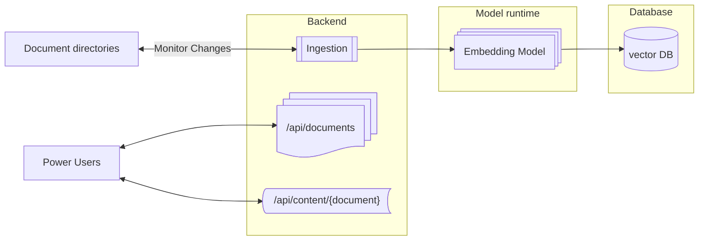
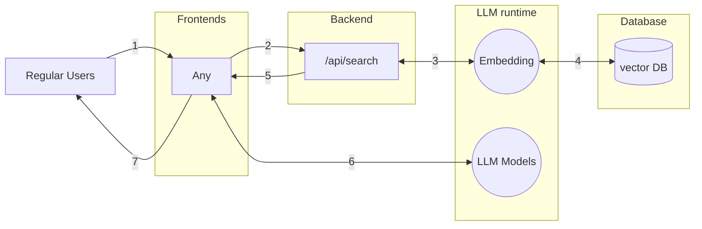

# ABACC RAG

ABACC RAG stands for Attribute-Based Access Controlled Context for Retrieval-Augmented Generation, exploring an organization-level AI sovereignty.

Most retrieval examples typically consider the user feeding the LLM with a series of documents deemed relevant to their prompting activity.
While this approach has direct value for a single user, it lacks value at the organizational level. However, the most complex challenge with organization-wide knowledge is **who can access what, from where, and when**. 

The ABACC RAG illustrates the ability to leverage enriched metadata, with, in this example, the usage of extended attributes at a Unix/Linux file system level, or managed at scale with a third-party enterprise solution like [NetApp BlueXP Classification](https://docs.netapp.com/us-en/bluexp-classification/concept-cloud-compliance.html). 

## Overview

ABACC RAG was a prototype designed to showcase a Copilot for Microsoft Office 365 replacement, featuring an organization-level AI sovereignty architecture. 

The components are:
- a Python backend:
    - ingesting data and metadata (including extended attributes) from a given directory in ChromaDB 
    - retrieving an ingested document list via an API endpoint
    - retrieving context filtered by the attribute-based access control, and submitting the context and prompt to the model via an API endpoint 
- a web frontend for a classic off-application chatbot 
- a Microsoft Word Add-in for in-application chat and insertion 

For more details, you can go through [the documentation](DOCS/README.md)

## Documentation

### Concepts

### Attributes
The construct of additional attributes is to enrich the classic POSIX permissions in two ways:
- the operation-based attributes, like adding an attribute to a file to set an append-only, immutable, secure, and undeletable attribute.
- the extended attributes that a user would define through the 4 existing classes: user, security, system, and trusted.

This use case is about the extended attributes, but the operation-based attributes examples are [available here](ops-attr.md).

### Extended attributes
We will focus on the user namespace, meaning that extended attributes interact with applications; without extended application awareness, these extended attributes are essentially useless.
This example has been realized on a Linux operating system - MacOS comes with a different CLI command called ```xattr```. 

Let's create a file with some random content:
```
$ echo "this is my document" > document.txt
$ cat document.txt
this is my document
```
Now we can add attributes that are meaningful for an organization-wide classification
```
$ setfattr -n user.approved_by -v 'Wiske' document.txt
$ setfattr -n user.status -v 'Final' document.txt
```
Then we can dump the set of extended attributes for the file
```
$ getfattr -d document.txt
# file: document.txt
user.approved_by="Wiske"
user.status="Final"
```

> [!NOTE]
> Exciting? Not really! While the [operation-based attributes](ops-attr.md) have a direct impact, the extended attributes don't. The impact will be handled at an application level, similar to the ABACC RAG.

### ABACC RAG
Organizations have been pouring millions of files into their storage systems over the years in an unstructured manner, resulting in a so-called data lake that resembles a data swamp more closely. As-is, this file real estate is a cost, a security burden, and a lifecycle nightmare with little return on investment.  

With data classification at scale, these cons can become pros, fostering a new wave of creativity and productivity within an organization. Thanks to the AI hype, the use of data pipelines has revamped data management practices to produce “drinkable” data from an organization's data swamp. 

ABACC RAG is a small-scale demonstration of content generation based on a user-defined context, with classification awareness provided through attribute-based access control.

### Architecture

#### Ingestion


Prompting


In this example, we have the following setup:
- ollama to run our models locally 
- a folder called documents with two files with specific content and attributes
- a crawler scouting for any new files or changes happening to the existing ones to process them
- the process chunks and vectorizes the data to chromadb leveraging the nomic-embed-text model
- the crawler also serves an API endpoint to build a context based on who is prompting the LLM, leveraging the extended attributes
- the LLM will get the prompt with a context IF there are any documents that the user can access based on the extended attributes

Now, at an enterprise level:
- the documents folder would be one or multiple NFS shares with millions of files
- a scalable ChromaDB deployment would be used
- the backend would be split into dedicated microservices that can scale based on their respective load and would not impact the RAG service if one fails
- the LLM models would run using a vLLM or similar runtime with the appropriate optimization for AMD, Intel Gen6, Gaudi, NVIDIA, ...
- an SSO implementation would be in place to recover the user and group attributes

### How does it look?

#### backend
Running the backend will provide a couple of different services:
- an API endpoint for the document catalog accessible via api/documents
  ```
  [{"approvedBy":"unknown","filename":"wiske_document.txt","id":"orig_doc_wiske_document_txt","status":"unknown"},{"approvedBy":"Wiske","filename":"suske_document.txt","id":"orig_doc_suske_document_txt","status":"final"}]
  ```
- an API endpoint for a context search accessible with user access control based on the extended attributes via api/search
  ```
  curl -X POST -H "Content-Type: application/json" -d '{
    "query": "summarize my documents",
    "user": "Suske"
  }' http://localhost:5000/api/search
  []
  romdalf@shadow:~/abac-llm/backend$ curl -X POST -H "Content-Type: application/json" -d '{
    "query": "What is the security policy?",
    "user": "Wiske"
  }' http://localhost:5000/api/search
  [{"chunk_index":0,"content":"Apple's Worldwide Developers Conference (WWDC) 2024, held from June 10-14, was a landmark event that placed Artificial Intelligence at its core, revealing Apple's distinct approach to integrating AI across its ecosystem. The major announcement was Apple Intelligence, a personal intelligence system designed to be deeply integrated into iOS 18, iPadOS 18, and macOS Sequoia, emphasizing privacy and on-device processing.\n\nApple Intelligence aims to understand and generate language and images, take actions across apps, and draw from users' personal context to simplify everyday tasks. Key features include:","distance":1.1859149932861328,"id":"doc_wiske_document_chunk_0","original_filename":"wiske_document.txt","user.approved_by":"unknown","user.status":"unknown"},{"chunk_index":3,"content":"Project Astra was unveiled as Google's vision for the future of AI assistants \u2013 a truly multimodal and real-time AI capable of understanding and interacting with the world around it through vision and voice. Demos highlighted its ability to provide immediate context and answer questions based on live camera feeds.\n\nDevelopers were not left out, with numerous announcements aimed at making AI development easier and more powerful. This included expanded support for Gemini in Android Studio, Firebase, and other developer tools. The introduction of Trillium, Google's sixth-generation Tensor Processing Unit (TPU), signifies a commitment to building robust infrastructure to power these advanced AI models. Google also emphasized responsible AI development, with expanded watermarking initiatives like SynthID to help identify AI-generated content.","distance":1.2343885898590088,"id":"doc_suske_document_chunk_3","original_filename":"suske_document.txt","user.approved_by":"unknown","user.status":"unknown"},{"chunk_index":4,"content":"macOS Sequoia introduces iPhone Mirroring, allowing users to fully access and control their iPhone directly from their Mac, with notifications appearing on the Mac and files easily transferable. Safari gains a \"Highlights\" feature that uses machine learning to summarize webpages and quickly surface key information like directions or article summaries.\n\nwatchOS 11 for Apple Watch focuses on health and fitness, with a new Vitals app that monitors key health metrics and alerts users to unusual patterns. The Training Load feature helps users understand the impact of their workouts. The Smart Stack becomes even smarter, with new widgets and more context-aware suggestions.\n\nFinally, visionOS 2 for Apple Vision Pro introduced new ways to interact with spatial photos, including transforming existing photos into spatial ones, and brought an ultra-wide Mac virtual display for a more expansive computing experience.","distance":1.2647531032562256,"id":"doc_wiske_document_chunk_4","original_filename":"wiske_document.txt","user.approved_by":"unknown","user.status":"unknown"},{"chunk_index":2,"content":"Beyond Apple Intelligence, WWDC 2024 also unveiled significant updates to Apple's operating systems:","distance":1.2765859365463257,"id":"doc_wiske_document_chunk_2","original_filename":"wiske_document.txt","user.approved_by":"unknown","user.status":"unknown"},{"chunk_index":1,"content":"Writing Tools: System-wide capabilities for rewriting, proofreading, and summarizing text, enhancing communication in Mail, Notes, Pages, and third-party apps.\nGenmoji: A fun new feature allowing users to create custom emoji by typing a description, which can then be used as stickers or reactions.\nImage Playground: A new app and system-wide API for generating playful images in various styles (Sketch, Illustration, Animation) based on text descriptions.\nSmarter Siri: A significantly revamped Siri with a more natural voice, improved contextual understanding, and the ability to take actions across apps. Siri can also tap into the on-device intelligence for more personalized and private responses.\nChatGPT Integration: A partnership with OpenAI brings ChatGPT directly into iOS, iPadOS, and macOS, allowing Siri to tap into ChatGPT's capabilities for broader knowledge when needed, with user permission and privacy in mind.","distance":1.282895803451538,"id":"doc_wiske_document_chunk_1","original_filename":"wiske_document.txt","user.approved_by":"unknown","user.status":"unknown"}]
  ```
  The above example shows no documents for Suske as no attributes match their profile, while Wiske has a match.

> [!NOTE]
> When the backend runs, it triggers the ollama API to call the model ```nomic-embed-text``` to process the embeddings with chromadb, which could be a lengthy process when crawling a massive amount of data with suboptimal hardware for such tasks.
  ```  
  romdalf@shadow:~$ ollama ps
  NAME                       ID              SIZE      PROCESSOR    UNTIL              
  nomic-embed-text:latest    0a109f422b47    370 MB    100% CPU     4 minutes from now
  ```

Here are the logs for a session:
```
(file-abac-llm) romdalf@shadow:~/file-abac-llm/backend$ python app_backend.py 
ChromaDB collection 'llm_documents_collection' ready.
Documents directory './documents' is not empty. Skipping dummy file creation.
Sideloading documents from './documents' to ChromaDB...
Files found in './documents': ['wiske_document.txt', 'suske_document.txt']
Attempting to process file from initial scan: ./documents/wiske_document.txt
Processing document: wiske_document.txt
Deleted existing chunks for wiske_document.txt from ChromaDB.
Attributes for wiske_document.txt: {'user.status': 'unknown', 'user.approved_by': 'unknown'}
Successfully processed and stored 5 chunks for 'wiske_document.txt'.
Attempting to process file from initial scan: ./documents/suske_document.txt
Processing document: suske_document.txt
Deleted existing chunks for suske_document.txt from ChromaDB.
Attributes for suske_document.txt: {'user.status': 'final', 'user.approved_by': 'Wiske'}
Successfully processed and stored 7 chunks for 'suske_document.txt'.
Sideloading complete.
Started monitoring directory './documents' for .txt file changes.
 * Serving Flask app 'app_backend'
 * Debug mode: off
WARNING: This is a development server. Do not use it in a production deployment. Use a production WSGI server instead.
 * Running on all addresses (0.0.0.0)
 * Running on http://127.0.0.1:5000
 * Running on http://172.18.162.186:5000
Press CTRL+C to quit
127.0.0.1 - - [18/Jun/2025 12:56:56] "GET /api/documents HTTP/1.1" 200 -
127.0.0.1 - - [18/Jun/2025 12:56:56] "GET /api/documents HTTP/1.1" 200 -
Document modified: ./documents/suske_document.txt
Processing document: suske_document.txt
Deleted existing chunks for suske_document.txt from ChromaDB.
Attributes for suske_document.txt: {'user.status': 'final', 'user.approved_by': 'Wiske'}
Successfully processed and stored 7 chunks for 'suske_document.txt'.
Document modified: ./documents/wiske_document.txt
Processing document: wiske_document.txt
Deleted existing chunks for wiske_document.txt from ChromaDB.
Attributes for wiske_document.txt: {'user.status': 'unknown', 'user.approved_by': 'unknown'}
Successfully processed and stored 5 chunks for 'wiske_document.txt'.
127.0.0.1 - - [19/Jun/2025 18:34:15] "GET /api/documents HTTP/1.1" 200 -
127.0.0.1 - - [19/Jun/2025 18:34:15] "GET /api/documents HTTP/1.1" 200 -
```

#### frontend
The frontend is a simple Node.js, React, and Tailwind user interface.


The user context influences the retrieval of the documents based on the extended attributes:

1. Suske prompts "when was the conference?", the backend returns zero documents, the LLM has no context, and can't provide an answer:  


1. Wiske prompts for the same question, the backend provides access to the two files, and the LLM uses these two files as context to return an answer:


