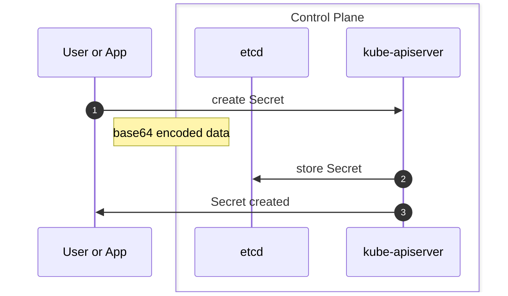
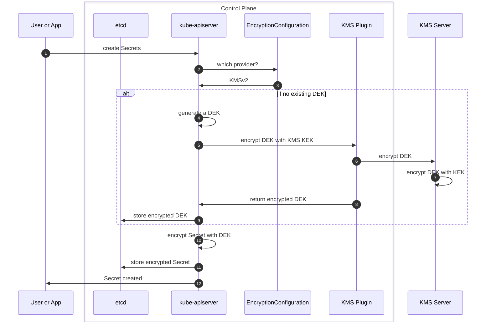

# kleidí


Initially, [romdalf](https://github.com/romdalf) founded [Trousseau](https://trousseau.io) in 2019 and released a production-grade KMSv1 provider plugin during his tenure at Ondat.  

With the Kubernetes project moving to KMSv2 stable with version 1.29 and KMSv1 being deprecated since 1.27, a decision needed to be made regarding Trousseau. 
Why? Simply put, the changes between KMSv1 and KMSv2 are significant, and instead of spending effort and time adapting the code, rewriting was faster, leading to the creation of Kleidi. 

The origin is Greek, and the meaning is "key". (Source: [Wikipedia](https://en.wiktionary.org/wiki/%CE%BA%CE%BB%CE%B5%CE%B9%CE%B4%CE%AF))

The project repository is available here: [kleidi](https://github.com/beezy-dev/kleidi)

!!! warning "Deprecation Notice"

    The Kubernetes provider plugin Trousseau is deprecated as it only supports KMSv1. In a production-grade environment,
    it is highly advised to deploy a plugin supporting KMSv2, like Kleidi. 

## implementation
kleidi has bootstrapped a code base from the [Kunernetes mock KMS plugin](https://github.com/kubernetes/kms/tree/master/internal/plugins/_mock). This provides a PKCS#11 interface for a local software HSM like [SoftHSM](https://www.opendnssec.org/softhsm/).

Based on a gRPC architecture requirement from the Kubernetes project, kleidi lives close to the API server on the master node(s).   
kleidi depends on a custom ```initContainer``` to bootstrap both SoftHSM, when using this option, and PCKS#11 interface.

With successful ```initContainer```, the ```kleidi-kms-plugin``` container starts to create a gRPC socket for the Kubernetes API server to use. 

### requirements
* KMSv2 support tested with Kubernetes 1.29 and onwards. 
* PCKS#11 interface to (Soft)HSM.
* DaemonSet deployment.
* Logging subsystem. 
* Plugin configuration.
* HashiCorp Vault and TPM package module placeholders.

### kleidi current state
* KMSv2 with Kubernetes 1.29 and onwards.
* PKCS#11 interface to [SoftHSM](https://www.opendnssec.org/softhsm/) deployed on the control plane nodes.   

***This version is a PoC and should never be used in production-grade environments.***

### Why 1.29 or later?
***Stability!***   

Any prior release marked KMSv2 as non-stable. Here is the extract from the [Kubernetes documentation](https://kubernetes.io/docs/tasks/administer-cluster/kms-provider/#before-you-begin):  
*The version of Kubernetes that you need depends on which KMS API version you have selected. Kubernetes recommends using KMS v2.*   
* *If you selected KMS API v2, you should use Kubernetes v1.29 (if you are running a different version of Kubernetes that also supports the v2 KMS API, switch to the documentation for that version of Kubernetes).*
* *If you selected KMS API v1 to support clusters before version v1.27 or if you have a legacy KMS plugin that only supports KMS v1, any supported Kubernetes version will work. This API is deprecated as of Kubernetes v1.28. Kubernetes does not recommend the use of this API.*

### kleidi future state
Considering the security exposures described in this document, an in-platform solution leveraging the (v)TPM chipset has been designed and tested:
* production-grade SoftHSM implementation. 
* HashiCorp Vault Community Edition/openbao integration.
* (v)TPM integration (see R&D)


## Why a KMS provider plugin for Kubernetes? 

### Physical/Virtual machine world
The entire IT organization is segmented into knowledge domains such as networking, storage, computing, and applications in the legacy world. 
When an application team asks for a virtual machine:
* The VMware Team has its credentials, which the Linux team cannot access.
* The Linux team will configure, maintain, and support the operating system and not share their credentials with any other team. 
* The application team will deploy their application, which might be connected to a database; the DBA will provide credentials.   
This quick overview can be enriched with all other layers like storage, backup, networking, monitoring, etc.
None will cross-share their credentials.

### Container platform world
Within Kubernetes, the states and configurations of every component, from computing to networking to applications and more, are stored within the ```etcd``` key-value datastore. 

Even if cloud-native applications can interact directly with a KMS provider like Vault, application and platform credentials are still stored within the cluster. This might also include the token to connect with the KMS provider.

All data fields are encoded in base64 but not encrypted. 

### kubernetes context
```Secrets``` objects in Kubernetes are stored in ```etcd``` with their data field encoded in base64 which is readable by everyone. While applications could see their Secrets being stored externally, the ones used by the platform itself can not be offloaded to avoid a platform collapse in case of network partitioning. 

Also, most third-party solutions addressing Secret management have a fallback mechanism to the standard Kubernetes Secret objects. This means that the security exposure will sooner or later be addressed. The Kubernetes project offers options to [encrypt data at rest](https://kubernetes.io/docs/tasks/administer-cluster/encrypt-data/), mitigating to some degree this security exposure.   

This handbook, which I co-authored, is a perfect reference for more details about the security exposure, mitigation path, and production-grade solutions: [Kubernetes Secrets Handbook](https://www.packtpub.com/product/kubernetes-secrets-handbook/).

The only viable option for a production-grade environment is to use the KMS provider plugin. With the release of Kubernetes ```1.29```, the kmsv2 is marked stable and documented in the article [KMS provider for data encryption](https://kubernetes.io/docs/tasks/administer-cluster/kms-provider/). 

### standard ```Secrets``` overview

When creating a ```Secrets``` object with the default mode, ```identity```, the user or application interacts with the Kubernetes API server. From a workflow perspective, we can resume this with the following steps:

1. user or application sends a create operation to the Kubernetes API server
2. assuming there is no existing objects, the Kubernetes API server will store the secrets in ```etcd```
3. the Kubernetes API server (hopefully) returns a creation success status



### kubernetes kmsv2  

Like networking, storage, cloud providers, and more, Kubernetes provides a high-level abstraction to simplify integration with third-party components, and the kmsv2 provider plugin follows the same principle.   

The Kubernetes API Server has been improved to include the ability to [encrypt data at rest](https://kubernetes.io/docs/tasks/administer-cluster/encrypt-data/). Different ways can be used to do so:

* the default ```identity``` mode leveraging the standard base64 encoding -> full exposure 
* the ```aescbc``` or ```aesgcm``` or ```secretbox``` modes with an encryption key -> the key is accessible from the control plane
* the ```kms``` mode leveraging an external KMS server like ```HashiCorp Vault```, ```Azure Key Vault```, ... -> the most secured approach for production-grade needs



## Security exposures

The following diagram takes a 10,000-feet overview to explore the security exposures leading to a potential secret leaking/spilling: 

* The secret comes from an external source and needs to be injected.  
* The base64 encoded secret will be ingested via the API server. 
* If a Kubernetes KMS provider plugin exists, the API server encrypts the data field using an envelope encryption scheme. 
* The secret and encrypted data filed will be stored within the ```etcd``` key-value datastore. 
* The ```etcd``` key-value datastore file is saved on a local volume on the control plane node filesystem. 

What are the exposures:

|Exposure | Risk | Mitigation |
|---------|------|------------|
|The secret comes from an external source. It requires a base64-encoded payload. | This transformation is a first-level exposure of the data field at file and console levels. | Work an injection mechanism from the password manager or KMS |  
| A common mistake is committing the secret YAML definition to a Git repository. | The credentials are exposed for life and will need to be rotated. | Don't include any YAML manifest with sensitive data in a Git repository even for testing purposes. Using a tool like SOPS can help prevent such scenario | 
| If no KMS provider plugin exists. | The API server stores the base64-encoded secret within the ```etcd``` key-value datastore. | Application secrets might benefit from an external KMS. Platform secrets will require a data encryption at rest option provided by Kubernetes. |
| If a KMS provider plugin exists. | The encryption Key or credentials to access the KMS or HSM are exposed in clear text. | Set up a mTLS authentication if possible. |
| The ```etcd``` key-value datastore is stored on the control plane filesystem. | The datastore file can be accessed if the node is compromised. | Encrypting the filesystem helps secure the datastore file from being read, except if the node has been compromised with root access. |
| The API server is the Kubernetes heart and soul. | If the appropriate RBAC or the API server is compromised, all protective measures will be useless since the API server will decrypt all sensitive data fields. | RBAC and masking the API server if possible | 

Thanks to Red Hat colleagues Francois Duthilleul and Frederic Herrmann for spending time analyzing the gaps.


