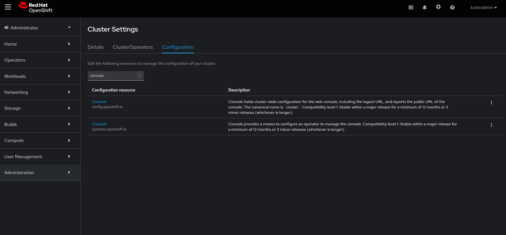
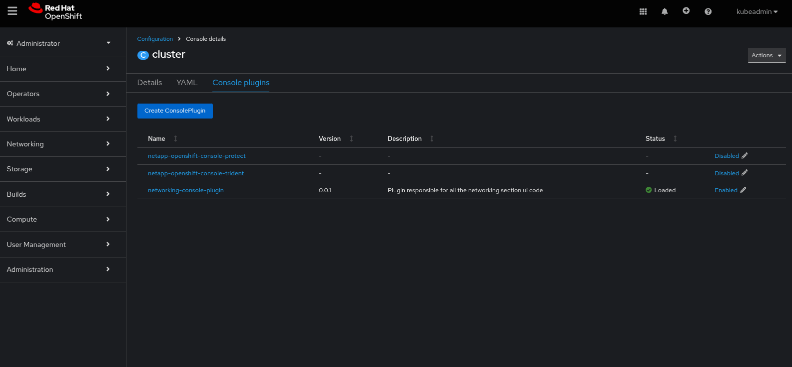
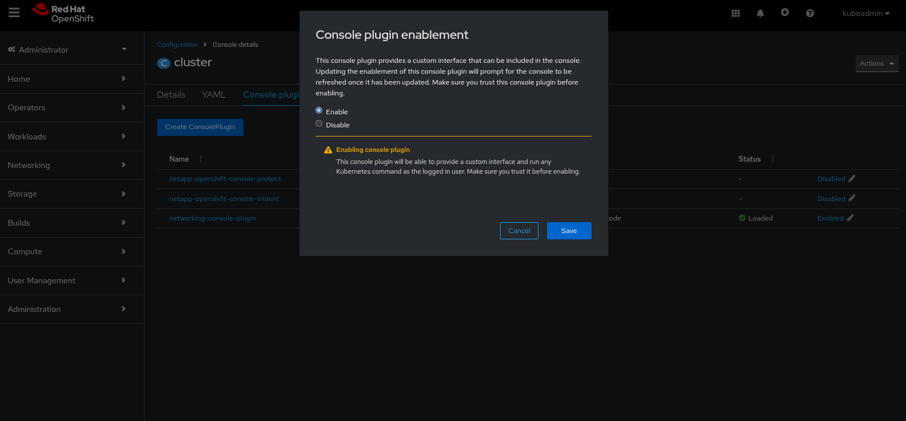
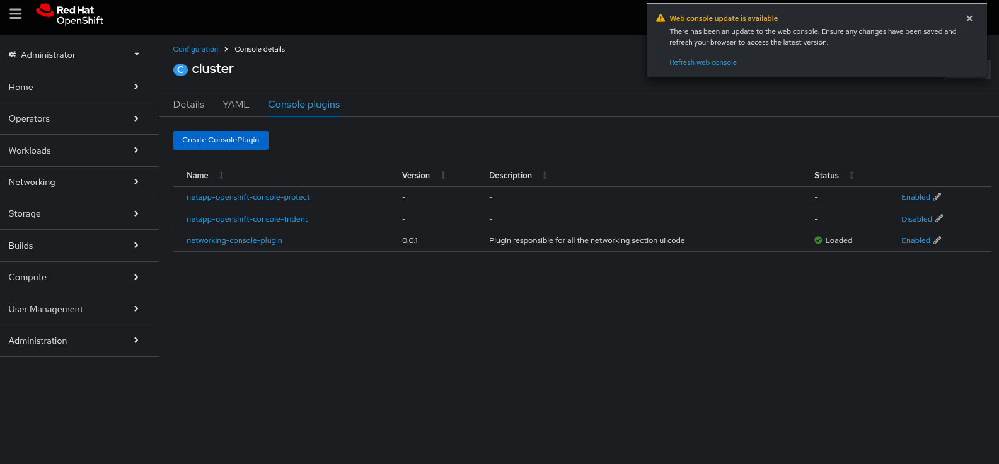
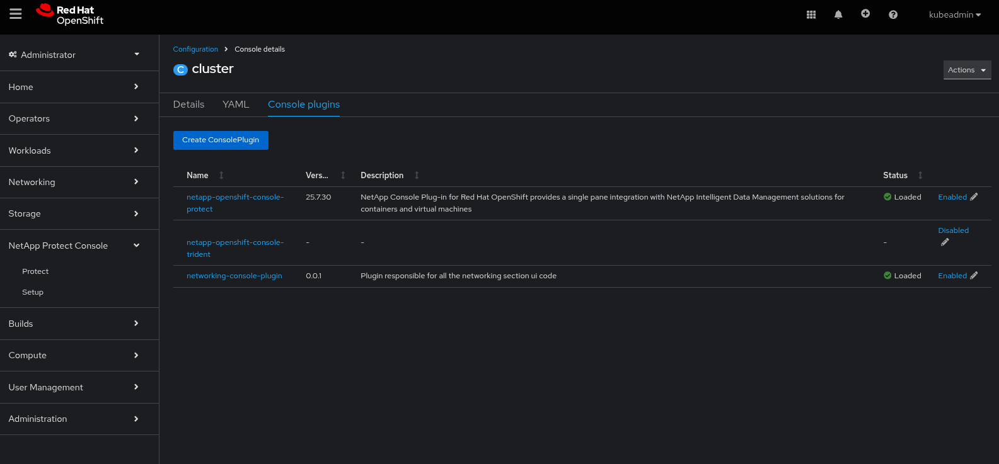

# NetApp Console Plugins for Red Hat OpenShift

Welcome to the NetApp OpenShift Console Plugins, a suite of open-source projects designed to significantly improve how you interact NetApp storage within your Red Hat OpenShift environment.  
These native OpenShift console plugins bring powerful storage and data management capabilities directly to your fingertips, simplifying complex tasks and accelerating your development and deployment workflows.

## Why Use the NetApp Console Plugins?
Managing persistent storage for critical workload can be complex, especially in a containerized environment. Our plugins solve this by providing an intuitive graphical user interface (GUI) inside the OpenShift console, allowing you to:

* Accelerate Deployment: Quickly deploy Trident, NetApp's dynamic storage orchestrator for Kubernetes, and Trident Protect with just a few clicks.
* Simplify Storage Management: Effortlessly create and manage volumes, snapshots, and business continuity directly from the console. No more command-line gymnastics!
* Enable Dataset Management: Take control of your data, particularly for workloads running in OpenShift, OpenShift AI, and Developer Hub. This is perfect for data-intensive and AI/ML projects.

## Console Plugins
We offer two powerful plugins to meet your storage management needs:

1. netapp-openshift-console-trident
This is your plugin for core Trident functionalities. It provides an intuitive GUI to:
    * Manage volumes and snapshots.
    * Create clones from snapshots. 
    * Import existing NetApp volumes to Red Hat OpenShift, even if not created with Trident
    * Expose volumes to Red Hat OpenShift AI for advanced data engineering workflows

2. netapp-openshift-console-protect
This is your plugin for workload protection with Trident Protect. It provides a simplified GUI to:
    * Create, schedule, and trigger on-demand application-aware local backups 
    * Create, schedule, and trigger on-demand application-aware remote backups 
    * Manage in-place restore
    * Manage restore as a new workload

## Getting Started
Both projects are currently in a pre-release phase and require an Early Access Program agreement. This agreement will grant you the necessary access token to deploy the plugins on your OpenShift cluster.

Prerequisites
* Red Hat OpenShift Container Platform 4.14, 4.15, 4.16, or 4.17.
* An access token from the Early Access Program.

## Documentation

### Prerequisites

* Get an Early Access Program token by reaching our to the NetApp Innovation Labs team at ng-innovation-labs-git[@]netapp.com
* Red Hat OpenShift 4.[15,16,17,18] on any footprint
* NetApp storage solutions
  * on-prem NetApp appliances with ONTAP
  * Any CVO flavors from AWS, Azure, Google
  * AWS FSxN
  * Azure NetApp Files
* Helm 3

### Install/Uninstall

#### Helm Repository
Add the Helm repository:
```sh
helm repo add innovation-labs https://netapp.github.io/Innovation-Labs/
```

**If you have already the repository in your collection, skip this step and update it:**
```sh
helm repo update
```

Check the repository content:
```sh
helm search repo innovation-labs 
```
Expected output:
```
NAME                                                    CHART VERSION   APP VERSION     DESCRIPTION
innovation-labs/netapp-connector                        2.1.13          2.1.4           A Helm chart for deploying netapp-connector as ...
innovation-labs/netapp-openshift-console-protect        25.7.1          25.6.25         NetApp Console Plug-in for Red Hat OpenShift pr...
innovation-labs/netapp-openshift-console-trident        25.7.1          25.6.25         NetApp Console Plugin for Red Hat OpenShift pro...
```

#### Install the NetApp Trident Console Plugin for Red Hat OpenShift
Run the Helm install command:
```sh
helm install netapp-openshift-console-trident innovation-labs/netapp-openshift-console-trident \
  --namespace netapp-openshift-console-trident --create-namespace \
  --set plugin.imageCredentials.registry=ghcr.io \
  --set plugin.image.tag=25.7.30 
``` 

> [!IMPORTANT]
> The namespace should not be change as it is linked to the Red Hat OpenShift Console manifest.
> If for any reasons, you wish to deploy in a different namespace, please reach out to the team.

#### Install the NetApp Protect Console Plugin for Red Hat OpenShift
Run the Helm install command:
```sh
helm install netapp-openshift-console-protect innovation-labs/netapp-openshift-console-protect \
  --namespace netapp-openshift-console-protect --create-namespace \
  --set plugin.imageCredentials.registry=ghcr.io \
  --set plugin.image.tag=25.7.30 
``` 

> [!NOTE]
> The ```plugin.imageCredentials.registry``` allows you to select a container registry the image is available.   
> The ```plugin.image.tag``` allows you to select a specific version to deploy.   

> [!IMPORTANT]
> The namespace should not be change as it is linked to the Red Hat OpenShift Console manifest.
> If for any reasons, you wish to deploy in a different namespace, please reach out to the team.


#### Enable a plugin
Console Plugins are disabled by default. To enable them after installation, follow these steps:

Go in ```Administration\Cluster Settings``` and search for ```Console``` then click on the one related to ```operator.openshift.io```.   


Click on the tab ```Console Plugins``` to display the existing list of plugins. The plugin should appear in the list as "Disabled" if the deployment with Helm was successfuly.   


Click on ```Disabled``` to open the ```Console plugin Enablement``` window and change it to ```Enable``` then ```Save```.   


After a couple of minutes, a notification should invite you to refresh the console, click on ```Refresh web console```.   


After refreshing the web console, the Description should have been populated and the new ```NetApp Protect Console``` is now appearing in the menu item list ready to be used.   


#### Uninstall a plugin
First disable the plugin as following the same steps as for enabling it. 

Then, if the plugin was deployed as per this document, run the following:
```
helm uninstall netapp-openshift-console-trident -n netapp-openshift-console-trident
```
Expected output:
```
release "netapp-openshift-console-trident" uninstalled
```