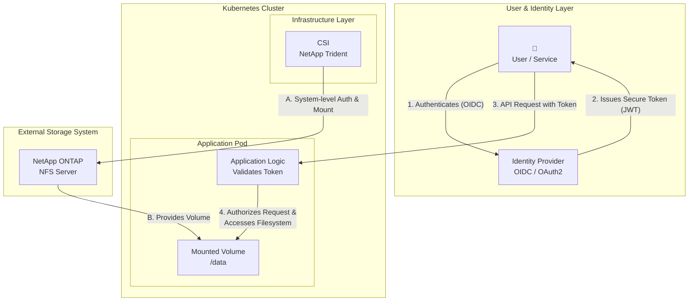
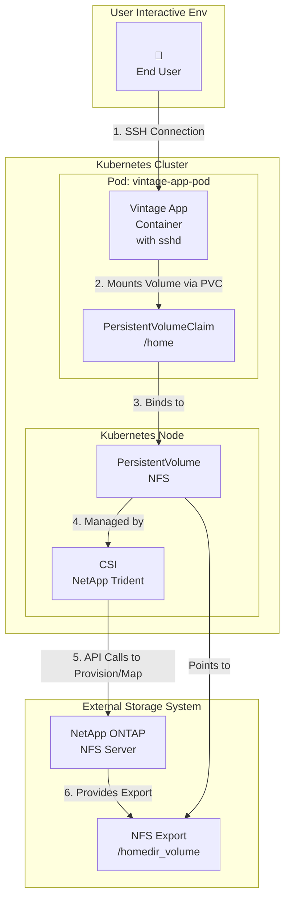
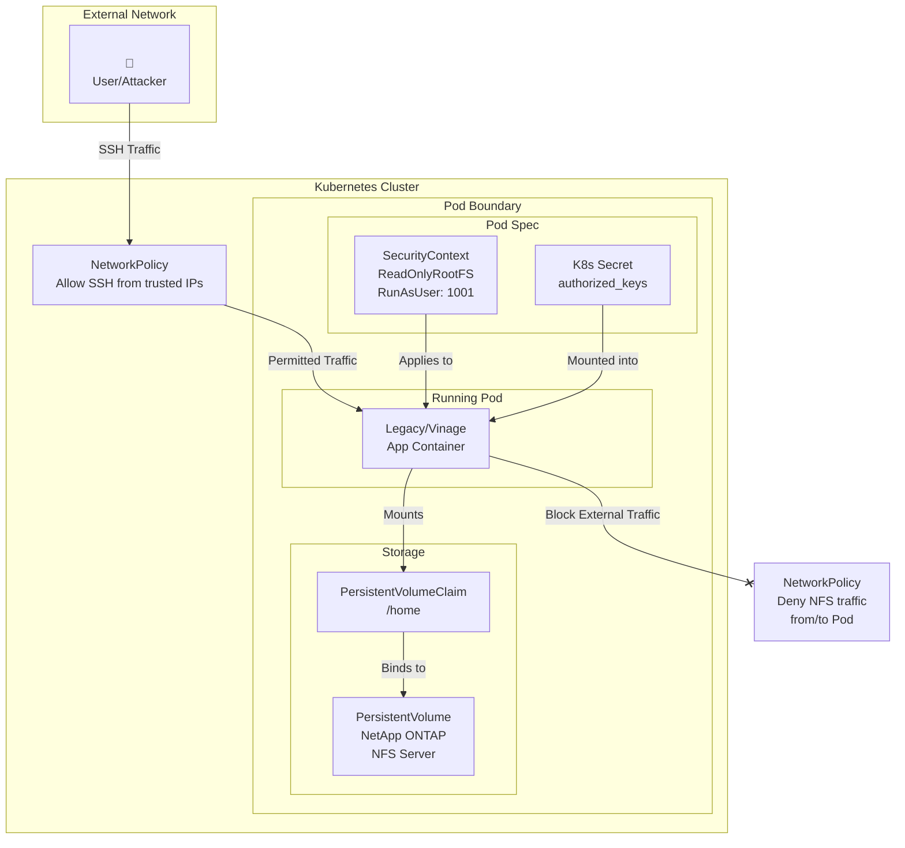
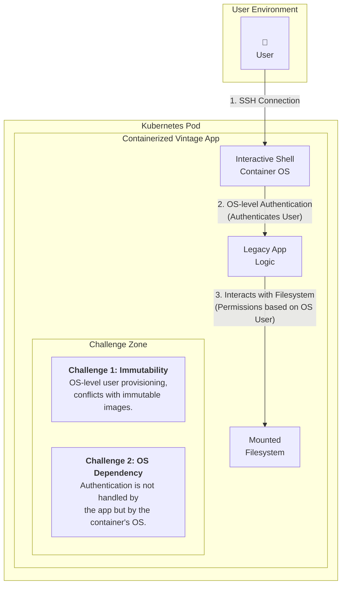
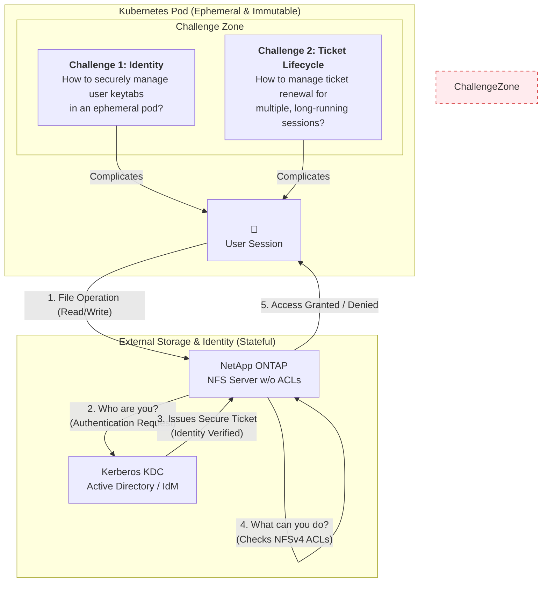
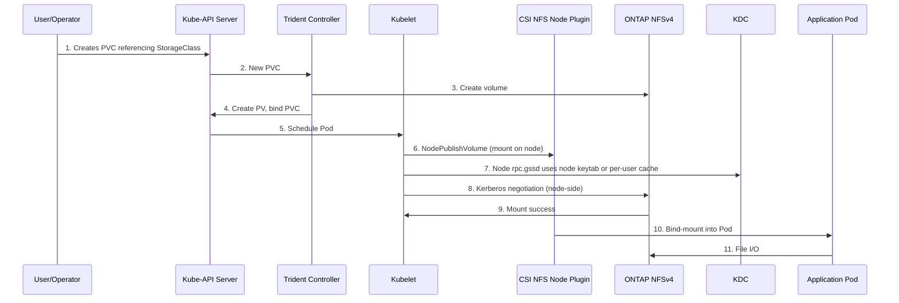
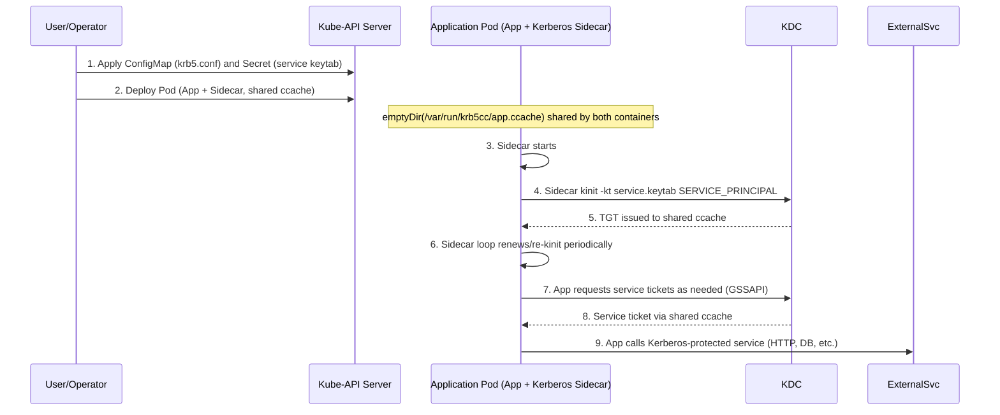
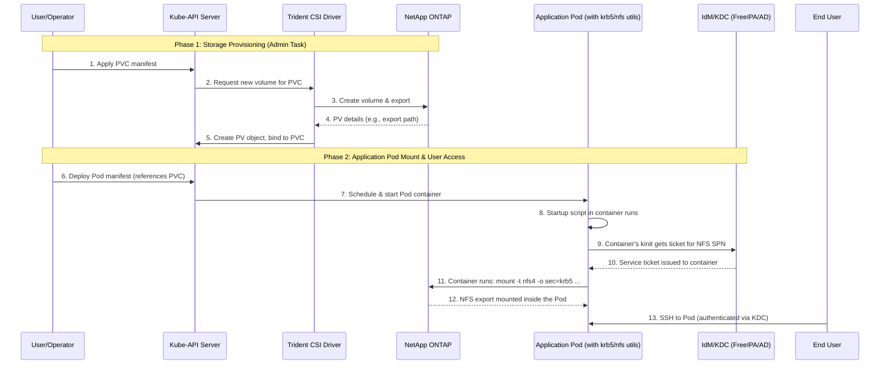

# Securing home directories for containerized vintage applications 

!!! warning "Status: **draft**"

    This document is a research document in a *Request for Comments* (RFC) format, product of the NetApp Office of the CTO - Innovation & Solutions Group.
         
    **Author(s)**    
    - Rom Adams, Principal Software Engineer, Office of the CTO - NetApp Inc.   
    **Contributor(s)**     
    - Elliott Ecton, Technical Marketing Engineer, Shared Platform Product Management - NetApp Inc.   
    - Erik Stjerna, Professional Services Consultant, Consulting - NetApp Inc.    
    - Johannes Wagner, Sr Solution Architect, Solution Engineering - NetApp Inc.    

    **Copyright Notes**     
    Copyright (c) 2025 NetApp Inc. and the persons identified as the document authors and contributors.    
    All rights reserved [https://www.netapp.com/company/legal/copyright/](https://www.netapp.com/company/legal/copyright/).

--- 

## Abstract
This RFC outlines the technical and operational challenges of implementing home directory management through NFS with an improved the security posture for containerized workloads in Kubernetes environments, specifically for legacy/vintage applications.   
While cloud-native applications benefit from a decoupled architecture that simplifies authentication and authorization from the operating system layer, legacy applications present unique constraints due to their reliance on interactive shell environments, persistent user contexts, and the ephemeral and immutable nature of containers.

--- 

## Introduction
In a Kubernetes environment, integrating NFS home directories with ONTAP using Trident, the NetApp Container Storage Interface (CSI), combines storage orchestration with secure, strong authentication and encryption. However, this approach requires coordinating additional layers like the Kubernetes cloud-native declarative model, and traditional Linux administration measures, and the CSI and NFS server.  

### Cloud-native application
In a modern cloud-native architecture, applications are decoupled from the underlying infrastructure, including how storage is accessed and how users are authenticated. A containerized application, designed without a direct interactive shell for users, handles identity and access control at the application layer, not at the operating system level.    

This model separates user/service identity from infrastructure permissions:     

- Filesystem Access (Infrastructure Layer): The application pod needs access to storage, like an NFS share. The Container Storage Interface (CSI) driver, running on the Kubernetes node, handles the technical requirements of mounting the storage. It authenticates the node or system service to the storage backend, mounts the volume, and makes it available to the pod. The end-user's identity is not involved in this process.    
- User/Service Authorization (Application Layer): When a user or another service interacts with your application, they are authenticated and authorized by the application itself, often using modern identity protocols.    
    - Authorization is managed with frameworks like OAuth2. This allows the application to grant other services limited, scoped access to its data on behalf of a user without ever sharing the user's credentials.    
    - Authentication is handled with protocols like OpenID Connect (OIDC), which is built on OAuth2. OIDC verifies a user's identity through an external identity provider and provides the application with a secure token (like a JWT), enabling features like Single Sign-On (SSO).    

In this scenario, the application uses the user's authenticated session and OIDC token to decide what data to read or write to the mounted filesystem. The pod's permission to access the storage is a separate concern, managed entirely by the Kubernetes infrastructure.



### Containerized vintage application
Vintage applications often rely on an interactive shell environment where users log in directly to manage the application and interact with the filesystem. In a traditional environment, this access is tightly coupled with the operating system's authentication system.    

This model creates significant challenges when containerized because it clashes with core cloud-native principles:     

- Tightly Coupled Architecture: The application's security model depends directly on the operating system handling user authentication for filesystem access. Unlike modern applications that manage identity separately, here, the container's OS is responsible for verifying who can touch which file.    
- Conflict with Immutability: Containers are designed to be immutable and ephemeral. The traditional process of joining a machine to a security realm and provisioning users at the OS level is a form of post-start configuration that goes against this principle. For security reasons, you cannot pre-bake user credentials or machine secrets into a container image.    
- Authentication at the OS Level: While a modern application would authenticate users at the application layer using protocols like OIDC, a vintage application forces this process down to the container's shell. A user needs to prove their identity directly to the container's OS to get the permissions needed to interact with the filesystem.   

Adapting such an application to a containerized environment requires a significant overhaul. It involves rethinking the entire deployment strategy to manage dynamic user authentication within an ephemeral container or, more effectively, refactoring the application to decouple it from the underlying operating system, moving it closer to a true cloud-native design.    



--- 

## Solution Proposals

This section describes the iterative process at the Kubernetes, base image, and storage layers to improve the security posture when containerizing a vintage application with a user interactive environment including home directories.  

--- 

### The Kubernetes cloud-native declarative model

#### Overview
These 10 controls harden the pod's environment and isolate it from the rest of the cluster, treating the container as a secure black box.   

- Isolate with Network Policies: This is your pod's firewall for a network defense-in-depth strategy. Even if an attacker compromise the container, these policies prevent them from using the pod to scan for or connect to other services on the network, including NFS. 
    - Create a ```NetworkPolicy``` to restrict SSH access (port 22) to only known, trusted IP ranges, like a corporate VPN or a bastion host, and including application ports.
    - Create a ```NetworkPolicy``` to deny all NFS traffic to/from the Pod Network.  
- Run with a Read-Only Root Filesystem: In your pod spec, set ```securityContext.readOnlyRootFilesystem: true```. This makes the container's base image immutable, preventing attackers from modifying system binaries or libraries. The user's home directory must be a separate, writable volume.   
- Use Secure Persistent Volumes (PV/PVC): The user's home directory must be persistent. Use a ```PersistentVolume``` pointing to a secure storage backend (like an NFSv4 share with Kerberos ```krb5p``` and ```root_squash``` enabled) and mount it into the pod.   
- Enforce Non-Root Execution: The SSH process must not run as root. Use ```securityContext.runAsUser``` and ```securityContext.runAsGroup``` with a high-numbered UID/GID (e.g., ```1001```) to minimize privileges.   
- Manage SSH Keys with Kubernetes Secrets: Never bake SSH keys (```authorized_keys``` or host keys) into the image. Store them in Kubernetes ```Secrets``` and mount them as files into the pod at runtime. This allows for secure, centralized management.   
- Use ```initContainers``` for Secure Setup: Apply traditional Linux hardening declaratively. An ```initContainer``` can run before your main application to set file permissions, apply chattr attributes, or perform other setup tasks on the persistent volume.   
- Build from Minimalist Base Images: Re-platform your legacy app onto a minimal base image like Alpine or a "distroless" image if possible. Remove all unnecessary tools (compilers, package managers, network utilities) from the final image to limit an attacker's toolkit.   
- Apply Pod Security Standards (PSS): Enforce cluster-wide security guardrails. Apply the ```baseline``` or ```restricted``` Pod Security Standard to the namespace where your application runs to prevent insecure configurations like running privileged containers.   
- Leverage Runtime Security Monitoring: Deploy a cloud-native runtime security tool like Falco. It can monitor for suspicious activity inside the container in real-time, such as unexpected shell processes or modifications to critical configuration files.   
- Control ```exec``` Access with RBAC: While users connect via SSH, administrators still have kubectl exec. Use Kubernetes RBAC (```Roles``` and ```RoleBindings```) to strictly limit who can get a shell in the pod through the Kubernetes API, closing a potential backdoor.    



#### Threat modeling asessment and controls

*Controls applied at the orchestration layer to isolate and secure the pod's environment.*

 Control/Measure | Threat Mitigated | Implementation Method | Assessment & Notes |
| :--- | :--- | :--- | :--- |
| **1. Network Policies** | Lateral Movement, Unauthorized Network Access | `NetworkPolicy` YAML resources | **Critical.** Acts as a pod-level firewall. Egress policies are crucial to prevent the pod from initiating unauthorized outbound connections. |
| **2. Read-Only Root Filesystem** | Malware Persistence, Binary Tampering | `securityContext.readOnlyRootFilesystem: true` | **High Impact.** Forces a clean separation between the immutable application and its state, but requires careful volume management for logs/temp files. |
| **3. Secure Persistent Volumes** | Unauthenticated Storage Access, Data Exposure | `PersistentVolume` configured for a secure backend (e.g., Kerberos) | Pushes storage security to the specialized storage layer, which is a best practice. The pod itself doesn't hold storage credentials. |
| **4. Run as Non-Root User** | Container-to-Node Privilege Escalation | `securityContext.runAsUser`, `runAsGroup` | **Fundamental.** The single most effective measure to limit the blast radius of a container compromise. |
| **5. K8s Secrets for Keys** | Credential Exposure, Hardcoded Secrets | Mount `Secret` as a volume or environment variable | **Essential Hygiene.** Decouples sensitive data from the container image, allowing for centralized and secure management via the K8s API. |
| **6. `initContainers` for Setup** | Insecure Default Permissions, Misconfiguration | `initContainers` definition in pod spec | Enables declarative, immutable hardening. Perfect for running `chattr` or complex permission setups on volumes before the main app starts. |
| **7. Minimalist Base Images** | "Living off the Land" Attacks, CVE Surface | `Dockerfile` `FROM alpine` or distroless | **High Impact.** Drastically reduces the attacker's toolkit if they gain a shell. Fewer packages mean fewer potential vulnerabilities. |
| **8. Pod Security Standards** | Insecure Pod Deployment, Privilege Escalation | Namespace labels for `baseline` or `restricted` policies | A proactive, cluster-wide guardrail that prevents insecure configurations from being deployed in the first place. |
| **9. Runtime Security Monitoring** | Zero-Day Exploits, Active Threats | Deploy a runtime tool like Falco or Trivy | A **detective** control. Essential for observing active threats and policy violations that preventative controls might miss. |
| **10. RBAC for `kubectl exec`** | Unauthorized Administrative Access, Backdoor | Kubernetes `Role` and `RoleBinding` | Secures the "break glass" access route. Ensures only authorized administrators can get a shell via the K8s API, complementing SSH controls. |


### Containerized vintage application with user interactive shell and home directories

#### Overview


#### Threat modeling asessment and controls

*Controls applied within the container to harden the OS and the services it runs.*

| Control/Measure | Threat Mitigated | Implementation Method | Assessment & Notes |
| :--- | :--- | :--- | :--- |
| **1. `ForceCommand`** | Shell Startup Script Injection (`.bashrc`) | `sshd_config` or `~/.ssh/authorized_keys` | **Highly Effective.** Directly prevents malicious commands from being executed at login. Can be used to force a clean shell. |
| **2. `ChrootDirectory`** | Filesystem Traversal, Information Disclosure | `sshd_config` directive | **Maximum Isolation.** The strongest sandboxing method for an SSH user, confining them strictly to their home directory. |
| **3. Harden `sshd_config`** | Weak Ciphers, Root Login, Credential Stuffing | Strict `sshd_config` settings | Basic security hygiene. Disables weak protocols and risky features like password authentication and root login. |
| **4. Immutable Startup Scripts** | Malicious Code Persistence, Unauthorized Changes | `chattr +i` on files like `.bashrc` | A powerful control that prevents modification even by the file's owner. Must be set by root (e.g., in an `initContainer`). |
| **5. Disable SSH Tunneling** | Network Pivoting, Bypassing Firewalls | `AllowTcpForwarding no` in `sshd_config` | **Critical.** Prevents the pod from being used as a beachhead to attack other services inside the cluster network. |
| **6. File Integrity Monitoring** | Undetected Tampering, Rootkits | AIDE configured inside the container | A **detective** control that provides an audit trail and alerts on unauthorized changes to critical files. |
| **7. Session Auditing** | Un-auditable User Actions, Insider Threat | `auditd` service and rules | Essential for forensics and compliance. Logs all commands executed by users, creating a detailed activity record. |
| **8. Strict Default `umask`** | Accidental Data Exposure Between Users | Set `umask 077` in `/etc/profile` | A simple but effective way to ensure that all user-created files are private by default. |
| **9. Restricted Shell (rbash)** | Unauthorized Command Execution | Set user's login shell to `/bin/rbash` | Only suitable for highly restricted, task-based roles where users need a very limited set of commands. |
| **10. Strict File Permissions** | Privilege Escalation, Unauthorized Access | `chmod` and `chown` on home directories | Enforce the principle of least privilege, ensuring users cannot read or write to each other's home directories. |


### Additional Consideration: Unifying Authentication and Authorization at the Storage Layer
Beyond the pod and container hardening, you can enforce a unified security model directly on the NFS server by combining Kerberos for authentication and NFSv4 ACLs for authorization. This pushes fine-grained access control to the storage layer itself, providing a robust last line of defense.    

- Kerberos for Authentication (Verifying "Who You Are"): Kerberos is a network authentication protocol that allows a user or service to securely prove its identity over an insecure network. When a pod needs to access the NFS share, Kerberos verifies the user's identity through a trusted third party, such as Active Directory. It uses secure tickets to handle this process, which can also be used to encrypt data in transit and ensure its integrity.   
- NFSv4 ACLs for Authorization (Controlling "What You Can Do"): Once a user's identity is confirmed by Kerberos, the NFS server can then use Access Control Lists (ACLs) to determine their permissions. ACLs offer granular control, allowing you to define precisely who can read, write, or execute specific files and directories. When a new file is created, it automatically inherits the permissions from its parent directory, ensuring consistent security policies.   

When combined, this creates a seamless security workflow: Kerberos first confirms the user's identity, and then the storage system (like NetApp ONTAP) enforces the ACLs to grant or deny access. This model tightly integrates authentication and authorization directly at the data layer.

However, such implementation for vintage application with user interactive environment introduces significant complexity because of the traditional, stateful, host-based security model to retrofit into an ephemeral and immutable container environment. In this model, the SSH connection is the single point of entry where the user's Kerberos identity is established for their entire session within the pod.

- The SSH Session acts as the Kerberos Gateway. The process works like a domino effect, where the initial SSH authentication is the crucial first step that makes everything else possible:
    - SSH Login: The user authenticates to the pod via SSH. The sshd daemon, configured with GSS-API, uses Kerberos to verify the user's identity.   
    - Ticket Caching: Upon a successful login, a valid Kerberos ticket for that specific user is created and cached within the pod's environment (managed by the sssd sidecar).   
    - Transparent Filesystem Access: From that point on, any action the user takes—whether running commands in their shell or using the legacy application—happens under their authenticated identity. When they try to access their home directory, the kernel transparently uses their cached Kerberos ticket to securely communicate with the NFS server.   
- This highlights a key distinction: it's not just SSH users, but any process that needs to access the NFS share requires a Kerberos identity. For interactive users, the SSH login is the mechanism that provides it. For any non-interactive system processes running in the container (like a cron job or a background service), they would also need their own Kerberos identity, typically provided by a system keytab file.   



#### Identity and Keytab Management
The biggest hurdle is securely managing the identities of multiple users inside a container. In a traditional VM, each user has a persistent identity managed by the OS. In a container, this is much harder.   

- Secure Keytab Distribution: Each user needs a keytab file to authenticate without a password. Securely distributing these sensitive files to an ephemeral pod is a major challenge. Baking them into the image is a severe security risk. Mounting them via Kubernetes Secrets is better, but managing secrets for numerous, potentially dynamic users, becomes a significant operational burden.   
- Joining the Realm: A traditional machine "joins" a Kerberos realm, creating a host identity (host/fqdn). A container, being ephemeral, cannot easily do this. You would need a complex, automated process to register and unregister each pod's identity with the Kerberos Key Distribution Center (KDC) upon startup and shutdown.

#### Ticket Lifecycle and Rotation
Kerberos tickets have a limited lifetime for security and must be renewed. Managing this for multiple, concurrent user sessions inside a single container is complex.   

- Ticket Caching: Each SSH session needs its own Kerberos ticket cache. The system must create, manage, and isolate these caches (e.g., using KEYRING or file-based caches like /tmp/krb5cc_UID) for every user, which can be difficult to configure correctly within a container's lifecycle.   
- Automated Ticket Renewal: A long-running process, like a krb5-daemon or sssd, is typically needed to automatically renew tickets before they expire. Running and managing such a system-level daemon within a container, especially for multiple users, adds complexity and deviates from the single-process-per-container best practice. If a user's ticket expires during a long session, their access to the NFS share will fail.   

#### Container Immutability and Networking
The core principles of containerization conflict with the requirements of a traditional Kerberos client.   

- Configuration Files: Kerberos requires configuration files like /etc/krb5.conf. While this can be managed with a ConfigMap, it means the container is less portable and has a hard dependency on the cluster's environment.    
- Service Discovery: The container must be able to reliably find the Kerberos KDC and other services. This often requires specific DNS configurations (SRV records) and network policies to allow traffic to the KDC, which can be complex to manage in a Kubernetes network environment.    
- Clock Skew: Kerberos is highly sensitive to time synchronization. If the container's clock drifts out of sync with the KDC's clock by more than a few minutes (typically 5), all authentication attempts will fail. Ensuring consistent time sync across all Kubernetes nodes and pods is critical.    

#### Threat modeling asessment and controls

*Controls that unify authentication and authorization directly at the data layer.*

 Control/Measure | Threat Mitigated | Implementation Method | Assessment & Notes |
| :--- | :--- | :--- | :--- |
| **1. Kerberos Authentication** | Identity Spoofing, Unauthenticated Access | Kerberos KDC, `sssd` daemon, `krb5.conf` | **Gold Standard.** Provides strong, cryptographic authentication for network services but introduces significant complexity. |
| **2. NFSv4 ACLs** | Improper Permissions, Data Exfiltration | `nfs4_setfacl` on the NFS server | Offers far more granular control than traditional POSIX permissions, allowing for complex authorization policies. |
| **3. Data-in-Transit Encryption** | Eavesdropping, Man-in-the-Middle Attacks | `sec=krb5p` in NFS mount and export options | Encrypts all NFS traffic. **Critical** for protecting sensitive data but comes with a performance overhead. |
| **4. SSSD Sidecar Pattern** | Manual Ticket Management, Expired Tickets | Sidecar container running `sssd` with a shared volume | **Architectural Solution.** Addresses the challenge of managing ticket rotation in an ephemeral container, but adds operational complexity. |
| **5. GSS-API in SSH** | Cumbersome User Login, Insecure Credential Forwarding | `GSSAPIAuthentication yes` in `sshd_config` | **User Experience.** Enables a seamless Single Sign-On experience for SSH, where the user's Kerberos ticket is used for authentication. |

## Desing Considerations 

### Application vs User

#### Application
An application itself would typically not need a direct GSS-API integration for filesystem access. In a Kubernetes environment, the process is handled transparently by two different components working together: the CSI driver at setup and the kernel during runtime.   

**CSI Driver and the Kernel** 
In a Kubernetes environment, accessing a secure storage volume involves a clear separation of responsibilities between the application, the Container Storage Interface (CSI) driver, and the node's kernel. This decouples the application from the underlying storage infrastructure.    

- The Application's Role: The application code is responsible only for its business logic. For file access, it uses standard POSIX system calls such as ```open()```, ```read()```, and ```write()```. The application operates on a volume mounted at a specific path inside its container and has no awareness of the storage protocol (NFS), the authentication mechanism (Kerberos), or the provisioning process.   
- The CSI Driver's Role: A CSI driver, such as NetApp Trident, is responsible for the storage provisioning and mounting lifecycle. When a pod requests a PersistentVolume, the CSI driver communicates with the Kubernetes control plane and the external storage system (e.g., NetApp ONTAP). It handles the initial, system-level Kerberos authentication required to securely mount the NFS export to the appropriate Kubernetes node. This is a one-time setup operation for the volume.   
- The Kernel's Role: The Linux kernel on the Kubernetes node is responsible for runtime file access. Once the CSI driver has successfully mounted the volume, the kernel's NFS client module manages all subsequent I/O operations. When the application performs a filesystem call, the kernel transparently handles the per-operation security requirements of the Kerberized NFS connection, using the credentials established during the initial mount.



This decoupling ensures the application remains portable and unaware of the infrastructure's security complexities (e.g., Kerberos), as the CSI driver manages the initial connection and the kernel handles all ongoing, transparent file access.

**When would an application need Kerberos-awareness?**   
When bypassing the Kubernetes' storage orchestration, the deployment is essentially treating the container like a traditional virtual machine, which has several critical implications. In other words, if a process or a user inside the container runs the mount command directly, the responsibility for authentication shifts from the infrastructure to the container itself.  



- Extreme privilege is required: the mount command requires elevated system privileges. The container must be started with the ```CAP_SYS_ADMIN``` capability, which is often called the "new root." This breaks nearly all container isolation, making the host kernel far more vulnerable to a container escape. This is a dangerous configuration and should be avoided.   
- The Container is now Responsible for authentication: because the Kubernetes infrastructure is no longer involved, the container must handle the entire Kerberos authentication process for the mount itself. This means:   
        - A full Kerberos client (kinit, etc.) must be installed inside the container image.  
        - The container needs access to a keytab file to authenticate. This creates a significant secret management problem.  
        - A process inside the container must run kinit to obtain a valid Kerberos ticket before attempting to run the mount command.  

#### User
Like the application, the behavior is mainly driven by the implementation, either leveraging the Kubernetes native orchestration or in-Pod mount and filesystem management. 

**Kubernetes native orchestration**   
The authentication and authorization model would in theory support a system-level mount with Kubernetes-managed POSIX permissions.

- Single-user per Pod connected via SSH
    In this scenario, there is a separation between user login authentication and filesystem authorization, making the per-user Kerberos ticket for NFS access unnecessary. The user still authenticates to get an SSH shell, but this process is now completely decoupled from how the filesystem is accessed. Its only job is to verify the user's identity to let them into the pod.   
- Filesystem Mount handled by CSI   
    The CSI driver, acting on behalf of the system, handles the Kerberos authentication to the NFS server. It uses a system-level identity (often a machine keytab) to mount the entire share into the pod. At this stage, the individual SSH user's identity might be irrelevant. The mount is established for the pod itself.   
- Filesystem Authorization handled by Kubernetes & POSIX   
    This is the key difference. Once the volume is mounted, access control is no longer managed by individual Kerberos tickets. Instead, it's governed by standard Linux permissions:  

    ```fsGroup```: Kubernetes ensures that all files within the volume are owned by this group ID.  
    ```supplementalGroups```: The user's process is granted membership in these groups.  
    ```fsGroupChangePolicy```: This policy ensures the permissions are correctly applied.  

Essentially, the user is authorized to access the files not because they have a personal Kerberos ticket, but because their process's group ID (managed by Kubernetes) matches the group ownership of the files on the already-mounted volume.

This workflow would imply:    

- System Mount: The Kubernetes CSI driver authenticates to the NFS server using a system-level Kerberos identity and mounts the volume into the pod.
- User Login: The single user logs in via SSH, authenticated by the IdP (LDAP).
- Permissions Applied: Kubernetes starts the user's process with the specified ```fsGroup``` and ```supplementalGroups``` IDs.
- Filesystem Access: When the user's process tries to read or write a file, the kernel performs a standard POSIX permission check (UID/GID), which succeeds because the group memberships match.

In this model, the Kerberos authentication happens only once at the system level, completely transparent to the end-user. The SSH session no longer acts as a "Kerberos Gateway" for filesystem access.

**Single-user and multi-user Pod**    
The first part of the model—the system-level mount—remains perfectly valid. The CSI driver will still use a single, system-level Kerberos identity to authenticate to the NFS server and mount the volume into the pod. This process is completely independent of how many users will eventually connect.

**Where the Model Breaks Down: Multi-User Authorization**    
The authorization part of the model fails because ```fsGroup``` and ```supplementalGroups``` are pod-level settings, not dynamic user-level ones.   

- Static Pod Identity: These settings are designed to grant a specific set of group permissions to the primary workload running in the pod. They are not designed to manage multiple, different users who log in interactively after the pod has started.   
- Fallback to POSIX Permissions: When multiple users connect via SSH, their sessions are authenticated by the IdP (LDAP). Each user's process runs with the UID and GID assigned to them in the IdP. At this point, filesystem access is determined purely by the traditional POSIX permissions (read/write/execute based on user, group, and other) on the files themselves, as seen by the NFS server. The ```fsGroup``` and supplementalGroups from the pod manifest become largely irrelevant to these new user sessions.   

This means no more the centralized, Kubernetes-native control over file permissions, reason why, putting a side the implementation complexity, the Kerberos model is better suited for multi-user environments:   

- Each user authenticates via SSH using their personal Kerberos ticket.
- The kernel uses this specific ticket for all NFS operations.
- The NFS server can then use this strong, per-user identity to enforce granular permissions, often with NFSv4 ACLs.

In summary, the system-level mount with ```fsGroup``` is ideal for a single-identity application workload. For a pod requiring multi-user, interactive access, the per-user Kerberos ticket model is the more robust and secure solution.

**when would an user require Kerberos-awarness?**   

See **When would an application need Kerberos-awareness?** in previous Application section. 
 

## Implementation

### Components
The followings provide a lightweight lab environment in AWS to perform an iterative test plan.    

- FreeIPA instance, Suse 15.6, with hostname ip-172-31-32-73
- Kubernetes instance, Suse 15.6 with hostname ip-172-31-46-200
- FSxN instance with SVM name svmnfsv4

#### FreeIPA server

Instance is a Suse 15.6 with latest updates installed including ```podman```. 

Create a persistent volume for FreeIPA:
```
podman volume create aaa.net.domain.local
```

Create a Pod with the necessary ports and mounts:
```
podman pod create \
    --name aaa.net.domain.local \
    --restart=always \
    -p 80:80 \
    -p 443:443 \
    -p 389:389 \
    -p 636:636 \
    -p 88:88 \
    -p 464:464 \
    -p 88:88/udp \
    -p 464:464/udp \
    -p 123:123/udp \
    -p 53:53/tcp \
    -p 53:53/udp \
    -v /etc/localtime:/etc/localtime:ro \
    -v /sys/fs/cgroup:/sys/fs/cgroup \
    -v aaa.net.domain.local:/data:Z
```

!!! warning
    These ports are privileged and require to modify the sysctl.conf to allow the mapping with, e.g., ```net.ipv4.ip_unprivileged_port_start=53```.    
    Then reload sysctl. 

Create the container with the associated Pod:

```
podman run -it \
    --name aaa \
    --pod aaa.net.domain.local \
    --restart=always \
    docker.io/freeipa/freeipa-server:almalinux-9-4.12.2
```

This will kick-off the interactive process to setup the domain. Once done, the prompt should return the container shell which will allow us to add our kubernetes host:

```
kinit admin
ipa host-add ip-172-31-46-200.net.domain.local --force
----------------------------------------------
Added host "ip-172-31-46-200.net.domain.local"
----------------------------------------------
  Host name: ip-172-31-46-200.net.domain.local
  Principal name: host/ip-172-31-46-200.net.domain.local@NET.DOMAIN.LOCAL
  Principal alias: host/ip-172-31-46-200.net.domain.local@NET.DOMAIN.LOCAL
  Password: False
  Keytab: False
  Managed by: ip-172-31-46-200.net.domain.local

ipa-getkeytab -s aaa.net.domain.local -p host/ip-172-31-46-200.net.domain.local -k /data/client.keytab
Keytab successfully retrieved and stored in: /data/client.keytab
```

At this stage, exit the shell to return to the host shell and copy the keytab and ca.crt to the kubernetes node:
```
podman volume inspect aaa.net.domain.local
[
     {
          "Name": "aaa.net.domain.local",
          "Driver": "local",
          "Mountpoint": "/home/ec2-user/.local/share/containers/storage/volumes/aaa.net.domain.local/_data",
          "CreatedAt": "2025-09-09T13:04:34.649436415Z",
          "Labels": {},
          "Scope": "local",
          "Options": {},
          "MountCount": 0,
          "NeedsCopyUp": true,
          "LockNumber": 0
     }
]

scp /home/ec2-user/.local/share/containers/storage/volumes/aaa.net.domain.local/_data/client.keytab ip-172-31-46-200:~/
scp /home/ec2-user/.local/share/containers/storage/volumes/aaa.net.domain.local/_data/etc/ipa/ca.crt ip-172-31-46-200:~/
``` 

Last, update the ```/etc/resolv.conf``` to ```127.0.0.1```. 

Here are screenshots of the GUI with all the details, including the user, groups, hosts added later on. 


#### Kubernetes node

Instance is a Suse 15.6 with latest updates installed including ```podman podman-docker nfs-client krb5-client sssd-tools krb5-client ca-certificates-mozilla adcli sssd-ad libipa_hbac0 sssd-ipa```. 

Setup the host to join the FreeIPA domain realm. 

Setup the retrieved files to the right directory:
```
cp ~/client.keytab /etc/krb5.keytab
chmod 600 /etc/krb5.keytab 
mkdir /etc/ipa
cp ~/ca.crt /etc/ipa/ca.crt
```

Configure ```/etc/krb5.conf```

```
# To opt out of the system crypto-policies configuration of krb5, remove the
# symlink at /etc/krb5.conf.d/crypto-policies which will not be recreated.
includedir  /etc/krb5.conf.d

[libdefaults]
    dns_canonicalize_hostname = false
    rdns = false
    verify_ap_req_nofail = true
    default_ccache_name = KEYRING:persistent:%{uid}

    default_realm = NET.DOMAIN.LOCAL
    dns_lookup_realm = false
    dns_lookup_kdc = true
    ticket_lifetime = 24h
    forwardable = true

[realms]
    NET.DOMAIN.LOCAL = {
      kdc = aaa.net.domain.local:88
      master_kdc = aaa.net.domain.local:88
      admin_server = aaa.net.domain.local:749
      default_domain = net.domain.local
      kinit_anchors = FILE:/etc/ipa/ca.crt
  }

[domain_realm]
    .net.domain.local = NET.DOMAIN.LOCAL
    net.domain.local = NET.DOMAIN.LOCAL

[logging]
    kdc = FILE:/var/log/krb5/krb5kdc.log
    admin_server = FILE:/var/log/krb5/kadmind.log
    default = SYSLOG:NOTICE:DAEMON
``` 

Then protect the configuration file ```chmod 600 /etc/krb5.keytab```. 
At this stage, running ```kinit admin``` should ask for credentials from the realm. If not, troubleshoot the error.


Configure ```/etc/sssd/sssd.conf```

```
[sssd]
config_file_version = 2
services = nss, pam
domains = NET.DOMAIN.LOCAL

[nss]
filter_groups = root
filter_users = root

[pam]

[domain/NET.DOMAIN.LOCAL]
id_provider = ipa
auth_provider = ipa
chpass_provider = ipa
access_provider = ipa
ipa_server = _srv_
ipa_domain = net.domain.local
ldap_tls_cacert = /etc/ipa/ca.crt
cache_credentials = True
```

Then protect the configuration file ```chmod 600 /etc/sssd/sssd.conf```. 
Run the ```pam-config``` to setup the creation of homedir for the realm users ```pam-config -a --sss --mkhomedir```.
Then start the ```sssd``` with ```systemctl enable --now sssd``` that should return a similar status:

```
● sssd.service - System Security Services Daemon
     Loaded: loaded (/usr/lib/systemd/system/sssd.service; enabled; preset: disabled)
     Active: active (running) since Wed 2025-09-10 08:15:52 UTC; 34min ago
   Main PID: 6069 (sssd)
      Tasks: 5
        CPU: 304ms
     CGroup: /system.slice/sssd.service
             ├─6069 /usr/sbin/sssd -i --logger=files
             ├─6070 /usr/lib/sssd/sssd_be --domain NET.DOMAIN.LOCAL --uid 0 --gid 0 --logger=files
             ├─6071 /usr/lib/sssd/sssd_nss --uid 0 --gid 0 --logger=files
             ├─6072 /usr/lib/sssd/sssd_pam --uid 0 --gid 0 --logger=files
             └─6073 /usr/lib/sssd/sssd_pac --uid 0 --gid 0 --logger=files

Sep 10 08:15:52 ip-172-31-46-200 sssd_pac[6073]: Starting up
Sep 10 08:15:52 ip-172-31-46-200 systemd[1]: Started System Security Services Daemon.
Sep 10 08:30:52 ip-172-31-46-200 sssd_be[6070]: GSSAPI client step 1
Sep 10 08:30:52 ip-172-31-46-200 sssd_be[6070]: GSSAPI client step 1
Sep 10 08:30:52 ip-172-31-46-200 sssd_be[6070]: GSSAPI client step 1
Sep 10 08:30:52 ip-172-31-46-200 sssd_be[6070]: GSSAPI client step 2
Sep 10 08:45:52 ip-172-31-46-200 sssd_be[6070]: GSSAPI client step 1
Sep 10 08:45:52 ip-172-31-46-200 sssd_be[6070]: GSSAPI client step 1
Sep 10 08:45:52 ip-172-31-46-200 sssd_be[6070]: GSSAPI client step 1
Sep 10 08:45:52 ip-172-31-46-200 sssd_be[6070]: GSSAPI client step 2
```

If the status is different, troubleshoot the error. 
Make sure that ```/etc/nsswitch.conf``` has ```sss``` added as follows:

```
passwd:         compat sss
group:          compat sss
```
Then issue the following command to valide the full setup:

```
id admin
uid=1907600000(admin) gid=1907600000(admins) groups=1907600000(admins)
```

This will confirm a working connection between the host and the KDC to retrieve tickets and verify identities. Now, we can install a test Kubernetes environment using ```kind```,```kubectl```, and ```helm```. 

Deploy a test environment:

```
kind create cluster
using podman due to KIND_EXPERIMENTAL_PROVIDER
enabling experimental podman provider
Creating cluster "kind" ...
 ✓ Ensuring node image (kindest/node:v1.34.0) 🖼
 ✓ Preparing nodes 📦
 ✓ Writing configuration 📜
 ✓ Starting control-plane 🕹️
 ✓ Installing CNI 🔌
 ✓ Installing StorageClass 💾
Set kubectl context to "kind-kind"
You can now use your cluster with:

kubectl cluster-info --context kind-kind

Thanks for using kind! 😊
```

Verify the readyness of the cluster
```
ec2-user@ip-172-31-46-200:~> kubectl get nodes -w
NAME                 STATUS     ROLES           AGE   VERSION
kind-control-plane   NotReady   control-plane   20s   v1.34.0
kind-control-plane   Ready    control-plane   47s   v1.34.0
```

Deploy NetApp Trident

```
helm repo add netapp-trident https://netapp.github.io/trident-helm-chart
helm install trident netapp-trident/trident-operator --version 100.2506.0 --create-namespace --namespace trident

NAME: trident
LAST DEPLOYED: Wed Sep 10 08:57:25 2025
NAMESPACE: trident
STATUS: deployed
REVISION: 1
TEST SUITE: None
NOTES:
Thank you for installing trident-operator, which will deploy and manage NetApp's Trident CSI
storage provisioner for Kubernetes.

Your release is named 'trident' and is installed into the 'trident' namespace.
Please note that there must be only one instance of Trident (and trident-operator) in a Kubernetes cluster.

To configure Trident to manage storage resources, you will now need to configure at least one storage
backend and add a matching storageClass.

Examples of backend and storageClass definitions are available at official NetApp Trident documentation.

Further, You may find all Trident releases and source code online at https://github.com/NetApp/trident.

To learn more about the release, try:

  $ helm status trident
  $ helm get all trident
```

Verify the deployment
```
kubectl -n trident get pods -w
NAME                                  READY   STATUS              RESTARTS   AGE
trident-controller-689cfc669f-flg7j   0/6     ContainerCreating   0          2s
trident-node-linux-8cdx4              0/2     ContainerCreating   0          1s
trident-operator-b999469bc-4r7rd      1/1     Running             0          39s
trident-node-linux-8cdx4              1/2     Running             0          5s
trident-node-linux-8cdx4              1/2     Running             0          10s
trident-controller-689cfc669f-flg7j   6/6     Running             0          14s
trident-node-linux-8cdx4              2/2     Running             0          31s
```

Setting up Trident Backend Configuration to interact with the SVM. First create a secret: 

```
kubectl create secret generic ontap-nas --namespace trident --from-literal=username=vsadmin --from-literal=password=SVMTrident234         
secret/ontap-nas created
``` 
Verify creation

```
kubectl get secret -n trident
NAME                            TYPE                 DATA   AGE
ontap-nas                       Opaque               2      13s
sh.helm.release.v1.trident.v1   helm.sh/release.v1   1      29m
trident-csi                     Opaque               6      29m
trident-encryption-keys         Opaque               1      29m

kubectl get secret -n trident ontap-nas -o yaml
```
The password data field can be double check with ```base64 -d``` to verify that the password didn't get truncated.

Create a TridentBackendConfig:

```YAML
apiVersion: trident.netapp.io/v1
kind: TridentBackendConfig
metadata:
  name: ontap-nas
  namespace: trident
spec:
  version: 1
  backendName: fsx-ontap
  storageDriverName: ontap-nas
  managementLIF: 172.31.47.242
  svm: svmnfsv4
  nasType: nfs
  nfsMountOptions: nfsvers=4.1, sec=krb5
  credentials:
    name: ontap-nas
```

```
kubectl apply -f tbc.yaml
tridentbackendconfig.trident.netapp.io/ontap-nas created
```
```YAML
apiVersion: trident.netapp.io/v1
kind: TridentBackendConfig
metadata:
  annotations:
    kubectl.kubernetes.io/last-applied-configuration: |
      {"apiVersion":"trident.netapp.io/v1","kind":"TridentBackendConfig","metadata":{"annotations":{},"name":"ontap-nas","namespace":"trident"},"spec":{"backendName":"fsx-ontap","credentials":{"name":"ontap-nas"},"managementLIF":"172.31.47.242","nasType":"nfs","nfsMountOptions":"nfsvers=4.1, sec=krb5","storageDriverName":"ontap-nas","svm":"svmnfsv4","version":1}}
  creationTimestamp: "2025-09-10T09:49:23Z"
  finalizers:
  - trident.netapp.io
  generation: 1
  name: ontap-nas
  namespace: trident
  resourceVersion: "6534"
  uid: c079e1e4-f515-4e6e-8cc2-18417ac16731
spec:
  backendName: fsx-ontap
  credentials:
    name: ontap-nas
  managementLIF: 172.31.47.242
  nasType: nfs
  nfsMountOptions: nfsvers=4.1, sec=krb5
  storageDriverName: ontap-nas
  svm: svmnfsv4
  version: 1
status:
  backendInfo:
    backendName: fsx-ontap
    backendUUID: 99b00c6b-edd7-4c9d-8a9e-d55fe09ba48f
  deletionPolicy: delete
  lastOperationStatus: Success
  message: Backend 'fsx-ontap' created
  phase: Bound
```

Create a StorageClass:

```YAML
apiVersion: storage.k8s.io/v1
kind: StorageClass
metadata:
  name: ontap-nfsv4
provisioner: csi.trident.netapp.io
mountOptions:
  - nfsvers=4.1
  - sec=krb5
  - nolock
parameters:
  backendType: "ontap-nas"
allowVolumeExpansion: true
volumeBindingMode: Immediate
```

```
kubectl apply -f sc.yaml
storageclass.storage.k8s.io/ontap-nfsv4 created

kubectl get sc/ontap-nfsv4
NAME          PROVISIONER             RECLAIMPOLICY   VOLUMEBINDINGMODE   ALLOWVOLUMEEXPANSION   AGE
ontap-nfsv4   csi.trident.netapp.io   Delete          Immediate           true                   10s
```

Create a test PVC:

```YAML
apiVersion: v1
kind: PersistentVolumeClaim
metadata:
  name: data-krb
spec:
  accessModes:
    - ReadWriteMany
  storageClassName: ontap-nfsv4
  resources:
    requests:
      storage: 1Gi
```

```
kubectl apply -f pvc.yaml
persistentvolumeclaim/data-krb created

kubectl get pvc -w
NAME       STATUS   VOLUME                                     CAPACITY   ACCESS MODES   STORAGECLASS   VOLUMEATTRIBUTESCLASS   AGE
data-krb   Bound    pvc-a6ce2f55-0579-47b8-b04e-805e4b4278b9   1Gi        RWX            ontap-nfsv4    <unset>                 7s
```

#### Deploying Pod

Create a test Pod:

```YAML
apiVersion: v1
kind: Pod
metadata:
  name: kerberos-user-pod-hardened
spec:
  securityContext:
    runAsUser: 1907600003
    runAsGroup: 5005
    fsGroup: 5005
    supplementalGroups: 
      - 5005
      - 6006
    fsGroupChangePolicy: "OnRootMismatch"
    runAsNonRoot: true # 
  containers:
    - name: test-container
      image: busybox:latest
      command: ["/bin/sh", "-c", "sleep 3600"]
      securityContext:
        allowPrivilegeEscalation: false
        capabilities:
          drop:
          - ALL
        privileged: false
        readOnlyRootFilesystem: false

      volumeMounts:
        - name: nfs-data
          mountPath: "/data/home" 
  volumes:
    - name: nfs-data
      persistentVolumeClaim:
        claimName: data-krb
```

#### Troubleshooting  

```
ipa host-add svmnfsv4.net.domain.local --force
--------------------------------------
Added host "svmnfsv4.net.domain.local"
--------------------------------------
  Host name: svmnfsv4.net.domain.local
  Principal name: host/svmnfsv4.net.domain.local@NET.DOMAIN.LOCAL
  Principal alias: host/svmnfsv4.net.domain.local@NET.DOMAIN.LOCAL
  Password: False
  Keytab: False
  Managed by: svmnfsv4.net.domain.local

ipa dnsrecord-add net.domain.local svmnfsv4 --a-rec=172.31.47.242
  Record name: svmnfsv4
  A record: 172.31.47.242

ipa service-add nfs/svmnfsv4.net.domain.local
--------------------------------------------------------------
Added service "nfs/svmnfsv4.net.domain.local@NET.DOMAIN.LOCAL"
--------------------------------------------------------------
  Principal name: nfs/svmnfsv4.net.domain.local@NET.DOMAIN.LOCAL
  Principal alias: nfs/svmnfsv4.net.domain.local@NET.DOMAIN.LOCAL
  Managed by: svmnfsv4.net.domain.local

ipa-getkeytab -p nfs/svmnfsv4.net.domain.local@NET.DOMAIN.LOCAL -k /tmp/client-ntap.keytab -e aes256-cts-hmac-sha1-96,aes128-cts-hmac-sha1-96
Keytab successfully retrieved and stored in: /tmp/client-ntap.keytab
```


```
services name-service dns create -domains net.domain.local -name-servers 172.31.32.73

services name-service dns show
                                                    Name
Vserver         Domains                             Servers
--------------- ----------------------------------- ----------------
svmnfsv4        net.domain.local                    172.31.32.73

services name-service dns check -name-server 172.31.32.73

       Name Server: 172.31.32.73
Name Server Status: up
    Status Details: Response time (msec): 1

services name-service ns-switch modify -database hosts dns, files

services name-service ns-switch show -database hosts

Name Service Switch Database: hosts
   Name Service Source Order: dns, files
```

```
podman volume create keytab-storage
keytab-storage

podman volume inspect keytab-storage
[
     {
          "Name": "keytab-storage",
          "Driver": "local",
          "Mountpoint": "/home/ec2-user/.local/share/containers/storage/volumes/keytab-storage/_data",
          "CreatedAt": "2025-09-10T16:28:26.27678136Z",
          "Labels": {},
          "Scope": "local",
          "Options": {},
          "MountCount": 0,
          "NeedsCopyUp": true,
          "NeedsChown": true,
          "LockNumber": 2
     }
]

ls -al /home/ec2-user/.local/share/containers/storage/volumes/keytab-storage/_data
total 4
drwxr-xr-x 2 ec2-user users  27 Sep 10 16:29 .
drwx------ 3 ec2-user users  19 Sep 10 16:28 ..
-rw------- 1 ec2-user users 196 Sep 10 16:29 client.keytab

chmod 644 /home/ec2-user/.local/share/containers/storage/volumes/keytab-storage/_data/client.keytab

podman run -d --name nginx-keytab-server -p 8080:80 -v keytab-storage:/usr/share/nginx/html:ro,Z docker.io/library/nginx:latest
Trying to pull docker.io/library/nginx:latest...
Getting image source signatures
Copying blob a785b80f5a67 done   |
Copying blob d107e437f729 done   |
Copying blob f1c4d397f477 done   |
Copying blob cb497a329a81 done   |
Copying blob f72106e86507 done   |
Copying blob 899c83fc198b done   |
Copying blob 6c50e4e0c439 done   |
Copying config 41f689c209 done   |
Writing manifest to image destination
WARN[0005] Failed to mount subscriptions, skipping entry in /etc/containers/mounts.conf: open /etc/zypp/credentials.d/SCCcredentials: permission denied
36ca20a52f2082ff3ef4993fb9681d6dd3ea8c1e490f14670b6f2de4f5136aec
```

```
nfs kerberos interface enable -lif nfs_smb_management_1 -spn nfs/svmnfsv4.net.domain.local@NET.DOMAIN.LOCAL -keytab-uri http://172.31.46.200:8080/client.keytab

Warning: Keys for encryption types "des-cbc-crc,des3-cbc-sha1,aes128-cts-hmac-sha1-96,aes256-cts-hmac-sha1-96" are required for Vserver "svmnfsv4"
         but found keys only for encryption types "aes128-cts-hmac-sha1-96,aes256-cts-hmac-sha1-96". Keys for encryption types
         "des-cbc-crc,des3-cbc-sha1" for service principal name "nfs/svmnfsv4.net.domain.local@NET.DOMAIN.LOCAL" are missing. Available keys will be
         imported. Do you want to continue? {y|n}: y

nfs kerberos interface show
               Logical
Vserver        Interface     Address         Kerberos SPN
-------------- ------------- --------------- -------- -----------------------
svmnfsv4       nfs_smb_management_1
                             172.31.47.242   enabled  nfs/svmnfsv4.net.domain.local@NET.DOMAIN.LOCAL
```

```
kerberos interface show -vserver svmnfsv4 -lif nfs_smb_management_1
  (vserver nfs kerberos interface show)

                   Vserver: svmnfsv4
         Logical Interface: nfs_smb_management_1
                IP Address: 172.31.47.242
          Kerberos Enabled: enabled
    Service Principal Name: nfs/svmnfsv4.net.domain.local@NET.DOMAIN.LOCAL
Permitted Encryption Types: aes-128, aes-256
      Machine Account Name: -
```

```
 export-policy rule show -vserver svmnfsv4 -policyname kerberos
             Policy          Rule    Access   Client                RO
Vserver      Name            Index   Protocol Match                 Rule
------------ --------------- ------  -------- --------------------- ---------
svmnfsv4     kerberos        1       nfs4     172.31.32.0/20,       krb5
                                              10.89.0.0/24
```

```
nc -zv 172.31.47.242 2049
ip-172-31-47-242.eu-west-3.compute.internal [172.31.47.242] 2049 (nfs) open
```


```
sudo  mount -t nfs -vvvv 172.31.47.242:/vol1 /mnt/test/
mount.nfs: timeout set for Thu Sep 11 07:46:23 2025
mount.nfs: trying text-based options 'vers=4.2,addr=172.31.47.242,clientaddr=172.31.46.200'

mount |grep 172
172.31.47.242:/vol1 on /mnt/test type nfs4 (rw,relatime,vers=4.2,rsize=65536,wsize=65536,namlen=255,hard,proto=tcp,timeo=600,retrans=2,sec=sys,clientaddr=172.31.46.200,local_lock=none,addr=172.31.47.242)
```

```
sudo mount -t nfs4 -vvvv -o sec=krb5 172.31.47.242:/trident_pvc_9e64b913_7d64_48e1_b640_6aea5e0b0951 /mnt/test/
mount.nfs4: timeout set for Thu Sep 11 14:09:28 2025
mount.nfs4: trying text-based options 'sec=krb5,vers=4.2,addr=172.31.47.242,clientaddr=172.31.46.200'
mount |grep 172
172.31.47.242:/trident_pvc_9e64b913_7d64_48e1_b640_6aea5e0b0951 on /mnt/test type nfs4 (rw,relatime,vers=4.2,rsize=65536,wsize=65536,namlen=255,hard,proto=tcp,timeo=600,retrans=2,sec=krb5,clientaddr=172.31.46.200,local_lock=none,addr=172.31.47.242)
```

rebinding via kubelet fails to accept permission even when forcing a admin-level token.


### Obvervations

While the system-level mount succeeds at the host level through the CSI driver identicating a healthy connection between the hosts and ONTAP, the container observed a silent failure from ```kubelet``` when attempting to recursively run the ```chown``` and ```chmod``` command to grant access to the specificed group ID(s).  

The root cause is linked to the entire kubernetes stack up to the Pod presented as non-root including ```kubelet``` leading to ```NFS4ERR_ACCESS```. As such the ONTAP will map the request to a non-privileged user leading to the silent failure. While he test container process starts with ```uid=1907600003```and is a member of groups ```5005``` and ```6006```, when trying to write to the volume, the NFS checks the file's permissions with no matching permissions.
 
While a ```no_root_squash``` or setting  ```-superuser krb5``` at the policy level would, in theory, address the behavior, the next error is linked to a authorization mismatched at the GSS due to the wrong security primitives being presented.  While presenting the appropriate authentication at the node level, the container is presenting itself with the wrong one, not a ```NFS4ERR_BAD_CRED``` or ```NFS4ERR_EXPIRED``` but returning ```NFSV4ERR_WRONG_SEC``` from ONTAP, the wrong type of ID presented based on the overall Kerberos authentication and authorization chain. 

The root cause is linked to a mismatch at the client level, ONTAP has granted one access at the node level to mount and access the filesystem, ```kubelet``` is also granted if set with the superuser, but the security context is not applied at the pod process level, calling for the process, the container, to present valid credentials. This can be done through the usage of a side car or running the SSSD within the container.


## Potential mitigations

### Running as a VM
Today's Kubernetes project called Kubevirt is widely used as an alternative to the most common hypervisors on the market, providing the benefit of traditional virtual machines along with containers for unified cloud-native deployment and management strategies.   
This option would reduce the complexity of retrofiting a vintage application to containers when considering the deep coupled integration from an operationg system, libraries, filesystem, and user management. 

### Pod with integrated SSSD 
This approach is basically attempting to mimic the behavior of a full standing virtual machine in a container by handling the Kerberos handshake at the Pod level. From an overall workflow, the process would: 

1. Storage Provisioning: this initial phase is a standard, automated process for provisioning storage in Kubernetes using a Trident CSI. This will provide a managed volume via Trident opening for snapshot, cloning, and local and remote backup with Trident Protect. 
2. Pod mount and user Access: this phase mounts the storage from within its own Pod environment, bypassing the standard kubelet mount process, with internal Kerberos ticket handling within the Pod leveraging built-in container image Kerberos utilities (kinit) to contact the KDC and acquire a service ticket for the NFS export. This can also include the user management access into the running pod. Their login is authenticated against the same central IdM/KDC, giving them access to the interactive shell and the securely mounted filesystem.



Reference: 

### Pod with sidecar
The Pod with integrated SSSD requires either a build image with scripts or an initContainer handling the registration with FreeIPA to have dynamic registration, which might be complex and open another set of security challenges too.    

The Pod with sidecar implementation addresses the following requirements:   
- **Separation of concerns:** The sidecar handles all the complex Kerberos logic, allowing the application container to remain lightweight and focused on its core function.   
- **Security:** Only the sidecar needs access to the sensitive keytab file. The main application only ever sees the less-sensitive ticket cache.   
- **Automated renewal:** The sidecar ensures the Kerberos tickets are automatically renewed, preventing authentication failures for long-running applications without manual intervention.   
- **Simplified application development:** Developers don't need to embed Kerberos dependencies or logic into their application images. The sidecar pattern is managed at the platform level.   

Compare to previous diagram, the following workflow is handling the Kerberos authentication, caching, and rotation through a sidecar:

