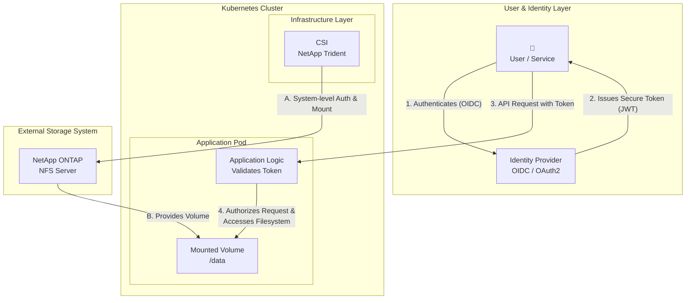
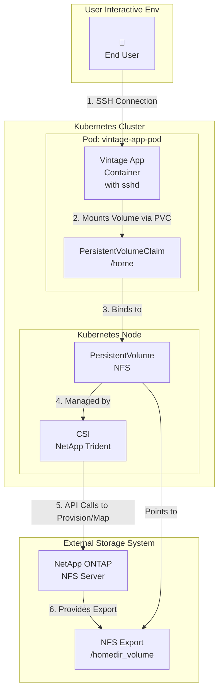
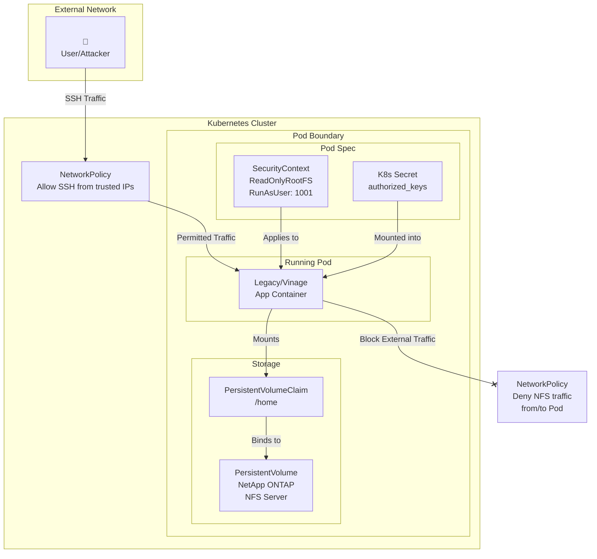
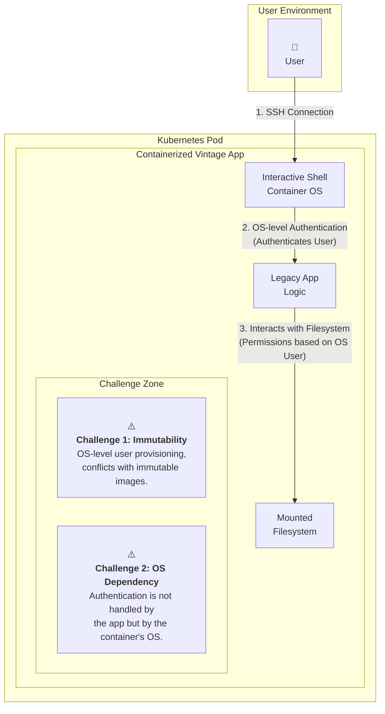
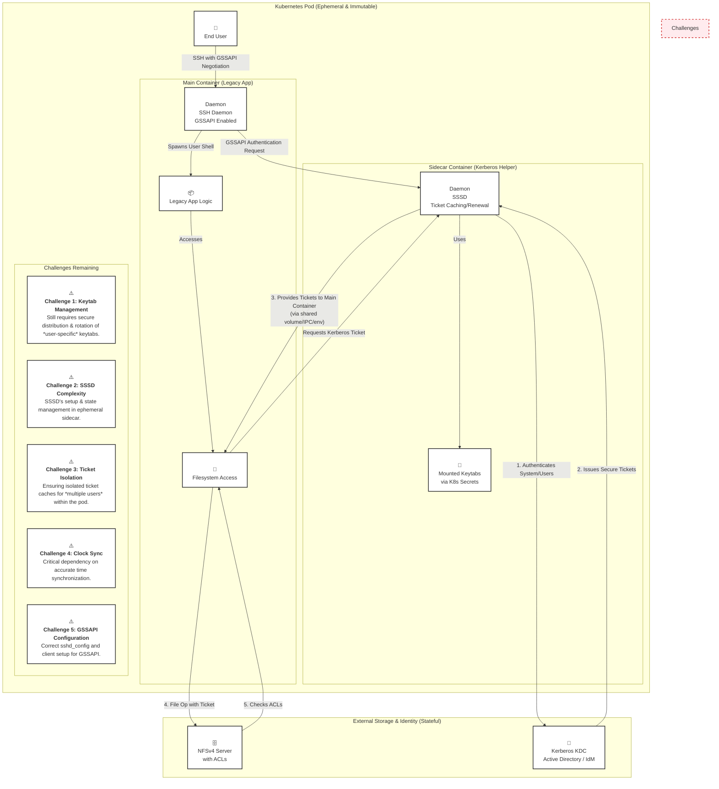

# Securing home direcotries for containerized vintage applications 

!!! warning "Status: **draft**"

    This document is a research document in a *Request for Comments* (RFC) format, product of the NetApp Office of the CTO - Innovation & Solutions Group.
         
    **Author(s)**    
    - Rom Adams, Principal Software Engineer, Office of the CTO - NetApp Inc.   
    **Contributor(s)**     
    - Elliott Ecton, Technical Marketing Engineer, Shared Platform Product Management - NetApp Inc.   
    - Erik Stjerna, Professional Services Consultant, Consulting - NetApp Inc.    
    - Johannes Wagner, Sr Solution Architect, Solution Engineering - NetApp Inc.    

    **Copyright Notes**     
    Copyright (c) 2025 NetApp Inc. and the persons identified as the document authors and contributors.    
    All rights reserved [https://www.netapp.com/company/legal/copyright/](https://www.netapp.com/company/legal/copyright/).

--- 

## Abstract
This RFC outlines the technical and operational challenges of implementing home directory management through NFS with an improved the security posture for containerized workloads in Kubernetes environments, specifically for legacy/vintage applications.   
While cloud-native applications benefit from a decoupled architecture that simplifies authentication and authorization from the operating system layer, legacy applications present unique constraints due to their reliance on interactive shell environments, persistent user contexts, and the ephemeral and immutable nature of containers.

--- 

## Introduction
In a Kubernetes environment, integrating NFS home directories with ONTAP using Trident, the NetApp Container Storage Interface (CSI), combines storage orchestration with secure, strong authentication and encryption. However, this approach requires coordinating additional layers like the Kubernetes cloud-native declarative model, and traditional Linux administration measures, and the CSI and NFS server.  

### Cloud-native application
In a modern cloud-native architecture, applications are decoupled from the underlying infrastructure, including how storage is accessed and how users are authenticated. A containerized application, designed without a direct interactive shell for users, handles identity and access control at the application layer, not at the operating system level.    

This model separates user/service identity from infrastructure permissions:     

- Filesystem Access (Infrastructure Layer): The application pod needs access to storage, like an NFS share. The Container Storage Interface (CSI) driver, running on the Kubernetes node, handles the technical requirements of mounting the storage. It authenticates the node or system service to the storage backend, mounts the volume, and makes it available to the pod. The end-user's identity is not involved in this process.    
- User/Service Authorization (Application Layer): When a user or another service interacts with your application, they are authenticated and authorized by the application itself, often using modern identity protocols.    
    - Authorization is managed with frameworks like OAuth2. This allows the application to grant other services limited, scoped access to its data on behalf of a user without ever sharing the user's credentials.    
    - Authentication is handled with protocols like OpenID Connect (OIDC), which is built on OAuth2. OIDC verifies a user's identity through an external identity provider and provides the application with a secure token (like a JWT), enabling features like Single Sign-On (SSO).    

In this scenario, the application uses the user's authenticated session and OIDC token to decide what data to read or write to the mounted filesystem. The pod's permission to access the storage is a separate concern, managed entirely by the Kubernetes infrastructure.



### Containerized vintage application
Vintage applications often rely on an interactive shell environment where users log in directly to manage the application and interact with the filesystem. In a traditional environment, this access is tightly coupled with the operating system's authentication system.    

This model creates significant challenges when containerized because it clashes with core cloud-native principles:     

- Tightly Coupled Architecture: The application's security model depends directly on the operating system handling user authentication for filesystem access. Unlike modern applications that manage identity separately, here, the container's OS is responsible for verifying who can touch which file.    
- Conflict with Immutability: Containers are designed to be immutable and ephemeral. The traditional process of joining a machine to a security realm and provisioning users at the OS level is a form of post-start configuration that goes against this principle. For security reasons, you cannot pre-bake user credentials or machine secrets into a container image.    
- Authentication at the OS Level: While a modern application would authenticate users at the application layer using protocols like OIDC, a vintage application forces this process down to the container's shell. A user needs to prove their identity directly to the container's OS to get the permissions needed to interact with the filesystem.   

Adapting such an application to a containerized environment requires a significant overhaul. It involves rethinking the entire deployment strategy to manage dynamic user authentication within an ephemeral container or, more effectively, refactoring the application to decouple it from the underlying operating system, moving it closer to a true cloud-native design.    



--- 

# Solution Proposals

This section describes the iterative process at the Kubernetes, base image, and storage layers to improve the security posture when containerizing a vintage application with a user interactive environment including home directories.  

--- 

## The Kubernetes cloud-native declarative model

### Overview
These 10 controls harden the pod's environment and isolate it from the rest of the cluster, treating the container as a secure black box.   

- Isolate with Network Policies: This is your pod's firewall for a network defense-in-depth strategy. Even if an attacker compromise the container, these policies prevent them from using the pod to scan for or connect to other services on the network, including NFS. 
    - Create a ```NetworkPolicy``` to restrict SSH access (port 22) to only known, trusted IP ranges, like a corporate VPN or a bastion host, and including application ports.
    - Create a ```NetworkPolicy``` to deny all NFS traffic to/from the Pod Network.  
- Run with a Read-Only Root Filesystem: In your pod spec, set ```securityContext.readOnlyRootFilesystem: true```. This makes the container's base image immutable, preventing attackers from modifying system binaries or libraries. The user's home directory must be a separate, writable volume.   
- Use Secure Persistent Volumes (PV/PVC): The user's home directory must be persistent. Use a ```PersistentVolume``` pointing to a secure storage backend (like an NFSv4 share with Kerberos ```krb5p``` and ```root_squash``` enabled) and mount it into the pod.   
- Enforce Non-Root Execution: The SSH process must not run as root. Use ```securityContext.runAsUser``` and ```securityContext.runAsGroup``` with a high-numbered UID/GID (e.g., ```1001```) to minimize privileges.   
- Manage SSH Keys with Kubernetes Secrets: Never bake SSH keys (```authorized_keys``` or host keys) into the image. Store them in Kubernetes ```Secrets``` and mount them as files into the pod at runtime. This allows for secure, centralized management.   
- Use ```initContainers``` for Secure Setup: Apply traditional Linux hardening declaratively. An ```initContainer``` can run before your main application to set file permissions, apply chattr attributes, or perform other setup tasks on the persistent volume.   
- Build from Minimalist Base Images: Re-platform your legacy app onto a minimal base image like Alpine or a "distroless" image if possible. Remove all unnecessary tools (compilers, package managers, network utilities) from the final image to limit an attacker's toolkit.   
- Apply Pod Security Standards (PSS): Enforce cluster-wide security guardrails. Apply the ```baseline``` or ```restricted``` Pod Security Standard to the namespace where your application runs to prevent insecure configurations like running privileged containers.   
- Leverage Runtime Security Monitoring: Deploy a cloud-native runtime security tool like Falco. It can monitor for suspicious activity inside the container in real-time, such as unexpected shell processes or modifications to critical configuration files.   
- Control ```exec``` Access with RBAC: While users connect via SSH, administrators still have kubectl exec. Use Kubernetes RBAC (```Roles``` and ```RoleBindings```) to strictly limit who can get a shell in the pod through the Kubernetes API, closing a potential backdoor.    



### Threat modeling asessment and controls

*Controls applied at the orchestration layer to isolate and secure the pod's environment.*

 Control/Measure | Threat Mitigated | Implementation Method | Assessment & Notes |
| :--- | :--- | :--- | :--- |
| **1. Network Policies** | Lateral Movement, Unauthorized Network Access | `NetworkPolicy` YAML resources | **Critical.** Acts as a pod-level firewall. Egress policies are crucial to prevent the pod from initiating unauthorized outbound connections. |
| **2. Read-Only Root Filesystem** | Malware Persistence, Binary Tampering | `securityContext.readOnlyRootFilesystem: true` | **High Impact.** Forces a clean separation between the immutable application and its state, but requires careful volume management for logs/temp files. |
| **3. Secure Persistent Volumes** | Unauthenticated Storage Access, Data Exposure | `PersistentVolume` configured for a secure backend (e.g., Kerberos) | Pushes storage security to the specialized storage layer, which is a best practice. The pod itself doesn't hold storage credentials. |
| **4. Run as Non-Root User** | Container-to-Node Privilege Escalation | `securityContext.runAsUser`, `runAsGroup` | **Fundamental.** The single most effective measure to limit the blast radius of a container compromise. |
| **5. K8s Secrets for Keys** | Credential Exposure, Hardcoded Secrets | Mount `Secret` as a volume or environment variable | **Essential Hygiene.** Decouples sensitive data from the container image, allowing for centralized and secure management via the K8s API. |
| **6. `initContainers` for Setup** | Insecure Default Permissions, Misconfiguration | `initContainers` definition in pod spec | Enables declarative, immutable hardening. Perfect for running `chattr` or complex permission setups on volumes before the main app starts. |
| **7. Minimalist Base Images** | "Living off the Land" Attacks, CVE Surface | `Dockerfile` `FROM alpine` or distroless | **High Impact.** Drastically reduces the attacker's toolkit if they gain a shell. Fewer packages mean fewer potential vulnerabilities. |
| **8. Pod Security Standards** | Insecure Pod Deployment, Privilege Escalation | Namespace labels for `baseline` or `restricted` policies | A proactive, cluster-wide guardrail that prevents insecure configurations from being deployed in the first place. |
| **9. Runtime Security Monitoring** | Zero-Day Exploits, Active Threats | Deploy a runtime tool like Falco or Trivy | A **detective** control. Essential for observing active threats and policy violations that preventative controls might miss. |
| **10. RBAC for `kubectl exec`** | Unauthorized Administrative Access, Backdoor | Kubernetes `Role` and `RoleBinding` | Secures the "break glass" access route. Ensures only authorized administrators can get a shell via the K8s API, complementing SSH controls. |


### Containerized vintage application with user interactive shell and home directories

### Overview


### Threat modeling asessment and controls

*Controls applied within the container to harden the OS and the services it runs.*

| Control/Measure | Threat Mitigated | Implementation Method | Assessment & Notes |
| :--- | :--- | :--- | :--- |
| **1. `ForceCommand`** | Shell Startup Script Injection (`.bashrc`) | `sshd_config` or `~/.ssh/authorized_keys` | **Highly Effective.** Directly prevents malicious commands from being executed at login. Can be used to force a clean shell. |
| **2. `ChrootDirectory`** | Filesystem Traversal, Information Disclosure | `sshd_config` directive | **Maximum Isolation.** The strongest sandboxing method for an SSH user, confining them strictly to their home directory. |
| **3. Harden `sshd_config`** | Weak Ciphers, Root Login, Credential Stuffing | Strict `sshd_config` settings | Basic security hygiene. Disables weak protocols and risky features like password authentication and root login. |
| **4. Immutable Startup Scripts** | Malicious Code Persistence, Unauthorized Changes | `chattr +i` on files like `.bashrc` | A powerful control that prevents modification even by the file's owner. Must be set by root (e.g., in an `initContainer`). |
| **5. Disable SSH Tunneling** | Network Pivoting, Bypassing Firewalls | `AllowTcpForwarding no` in `sshd_config` | **Critical.** Prevents the pod from being used as a beachhead to attack other services inside the cluster network. |
| **6. File Integrity Monitoring** | Undetected Tampering, Rootkits | AIDE configured inside the container | A **detective** control that provides an audit trail and alerts on unauthorized changes to critical files. |
| **7. Session Auditing** | Un-auditable User Actions, Insider Threat | `auditd` service and rules | Essential for forensics and compliance. Logs all commands executed by users, creating a detailed activity record. |
| **8. Strict Default `umask`** | Accidental Data Exposure Between Users | Set `umask 077` in `/etc/profile` | A simple but effective way to ensure that all user-created files are private by default. |
| **9. Restricted Shell (rbash)** | Unauthorized Command Execution | Set user's login shell to `/bin/rbash` | Only suitable for highly restricted, task-based roles where users need a very limited set of commands. |
| **10. Strict File Permissions** | Privilege Escalation, Unauthorized Access | `chmod` and `chown` on home directories | Enforce the principle of least privilege, ensuring users cannot read or write to each other's home directories. |


### Additional Consideration: Unifying Authentication and Authorization at the Storage Layer
Beyond the pod and container hardening, you can enforce a powerful, unified security model directly on the NFS server by combining Kerberos for authentication and NFSv4 ACLs for authorization. This pushes fine-grained access control to the storage layer itself, providing a robust last line of defense.    

- Kerberos for Authentication (Verifying "Who You Are"): Kerberos is a network authentication protocol that allows a user or service to securely prove its identity over an insecure network. When a pod needs to access the NFS share, Kerberos verifies the user's identity through a trusted third party, such as Active Directory. It uses secure tickets to handle this process, which can also be used to encrypt data in transit and ensure its integrity.   
- NFSv4 ACLs for Authorization (Controlling "What You Can Do"): Once a user's identity is confirmed by Kerberos, the NFS server can then use Access Control Lists (ACLs) to determine their permissions. ACLs offer granular control, allowing you to define precisely who can read, write, or execute specific files and directories. When a new file is created, it automatically inherits the permissions from its parent directory, ensuring consistent security policies.   

When combined, this creates a seamless security workflow: Kerberos first confirms the user's identity, and then the storage system (like NetApp ONTAP) enforces the ACLs to grant or deny access. This model tightly integrates authentication and authorization directly at the data layer.

References:   
- NFS Kerberos in ONTAP, NetApp TR-4616: [https://www.netapp.com/media/19384-tr-4616.pdf](https://www.netapp.com/media/19384-tr-4616.pdf)    
- ONTAP, NetApp: [https://docs.netapp.com/us-en/ontap/nfs-admin/enable-disable-nfsv4-acls-task.html](https://docs.netapp.com/us-en/ontap/nfs-admin/enable-disable-nfsv4-acls-task.html)    




### Threat modeling asessment and controls

*Controls that unify authentication and authorization directly at the data layer.*

 Control/Measure | Threat Mitigated | Implementation Method | Assessment & Notes |
| :--- | :--- | :--- | :--- |
| **1. Kerberos Authentication** | Identity Spoofing, Unauthenticated Access | Kerberos KDC, `sssd` daemon, `krb5.conf` | **Gold Standard.** Provides strong, cryptographic authentication for network services but introduces significant complexity. |
| **2. NFSv4 ACLs** | Improper Permissions, Data Exfiltration | `nfs4_setfacl` on the NFS server | Offers far more granular control than traditional POSIX permissions, allowing for complex authorization policies. |
| **3. Data-in-Transit Encryption** | Eavesdropping, Man-in-the-Middle Attacks | `sec=krb5p` in NFS mount and export options | Encrypts all NFS traffic. **Critical** for protecting sensitive data but comes with a performance overhead. |
| **4. SSSD Sidecar Pattern** | Manual Ticket Management, Expired Tickets | Sidecar container running `sssd` with a shared volume | **Architectural Solution.** Addresses the challenge of managing ticket rotation in an ephemeral container, but adds operational complexity. |
| **5. GSS-API in SSH** | Cumbersome User Login, Insecure Credential Forwarding | `GSSAPIAuthentication yes` in `sshd_config` | **User Experience.** Enables a seamless Single Sign-On experience for SSH, where the user's Kerberos ticket is used for authentication. |
