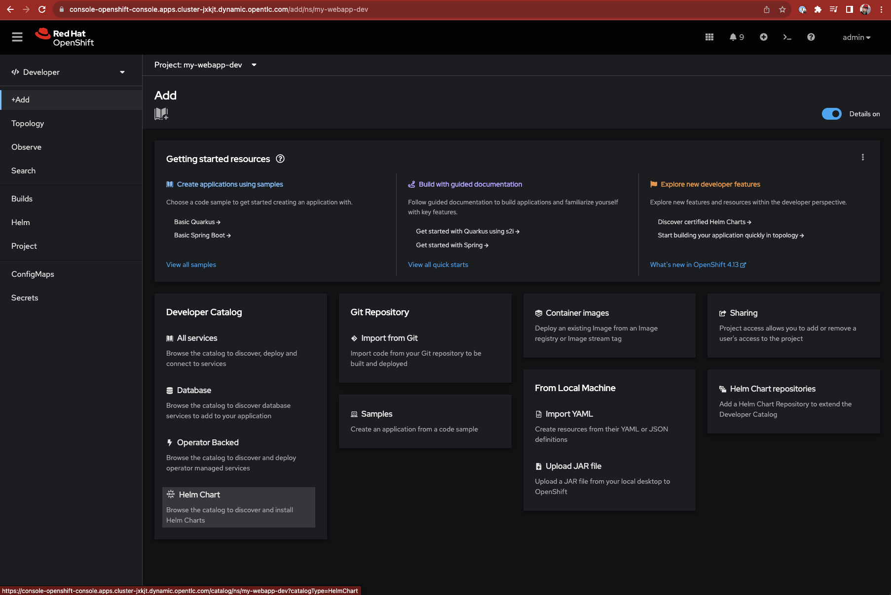
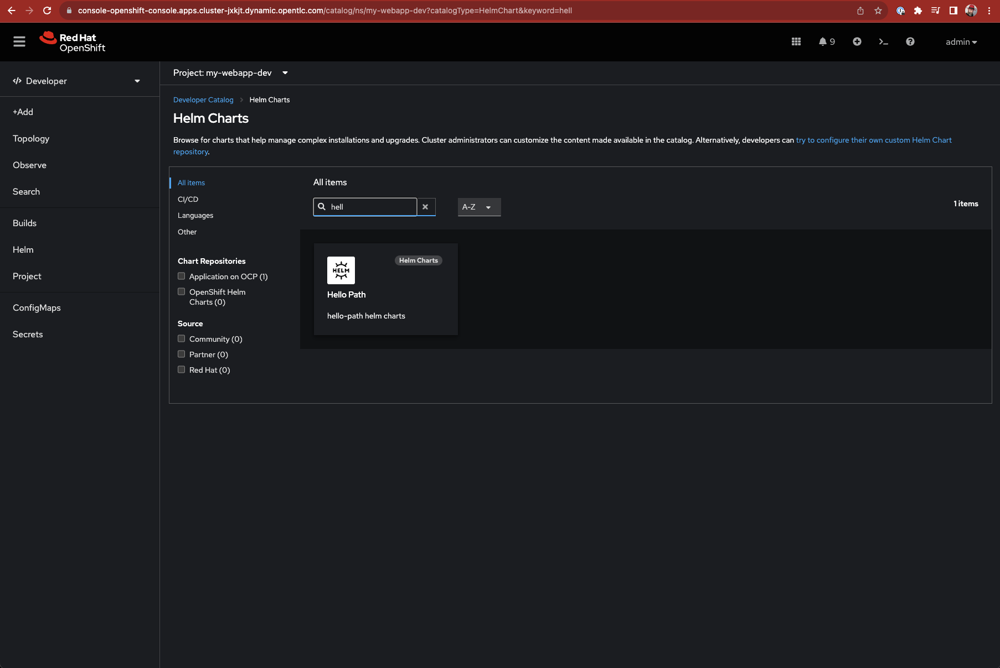
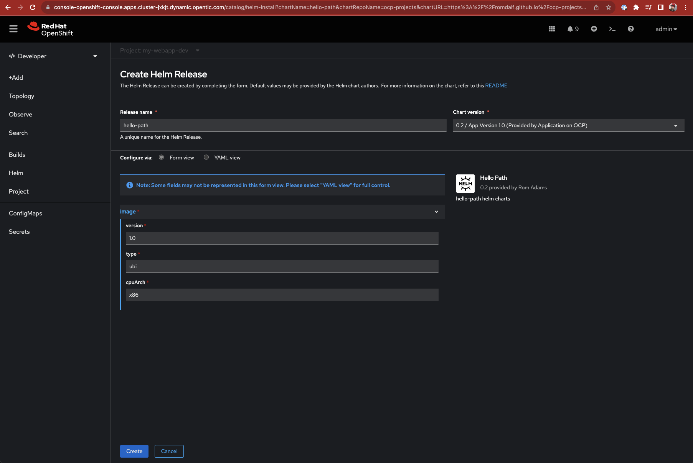

In this context, two version of a helm chart for Hello Path have been created; version 0.1 and 0.2, the main difference being the ability to define parameters at the deployment time.
The repository where these charts are hosted will be added within the Helm Developer Catalogue at cluster scope level. Doing so allows access to the helm charts to be deployed in any projects which in our case means ```my-webapp-dev```, ```my-webapp-tst```, ```my-webapp-prd```.

***Within the Developer view***   
Create the Helm Chart repo within OpenShift  


Deploy the application using the Helm Chart catalogue





At this stage, the quota prevents the deployment of the application. Let's edit the limts/requests to carry on with the deployment.


***Within the Administrator view***    
Going back to the quota dashboard, we can see the resource consumption of our application.  


To address the quota enforcement, the Helm charts have been updated to fit this request with default value and can be adapted upon the actual needs.  
Note that if the values are over what the quota definition is, the deployment will be stale till addressed.

  

Resulting in a smooth deployment  
