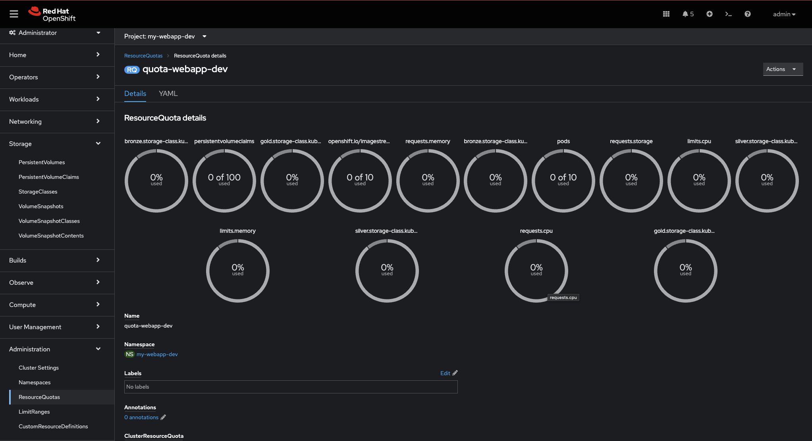

# OpenShift Project

A ```project``` is a logical space created on an OpenShift cluster corresponding to a ```namespace``` to host one or more pods that will have direct interaction with each other. 
As an example, a web front-end pod and a database pod could be deployed within a project called ```my-webapp```.

The CLI command to create a ```project``` is:   
```
oc new-project my-webapp --display-name="External web services" --description="External customer facing web service" 
```

The YAML API object definition is:  
```yaml 
--8<-- "sources/project.yaml"
```

Considering an application lifecycle, three projects could be created on a single OCP cluster:  

* ```my-webapp-dev```; where all the development will happen and each pull request from a git perspective could trigger pipeline update to build and deploy a new version of the application.

```yaml
--8<-- "sources/gitops/dev/project.yaml"
```

* ```my-webapp-tst```; where a release candidate would be deployed and goes through the functional and non-functional testing.

```yaml
--8<-- "sources/gitops/tst/project.yaml"
```
  
* ```my-webapp-prd```; where a release candidate has been validated and cut as the next go to release.

```yaml
--8<-- "sources/gitops/prd/project.yaml"
```

# quota


We often see that the last stage is hosted on a different platform to guarantee resource availability when dev/test activities are running and could potentially hog compute resources creating turbulences to other application running in production context.  
To avoid this situation, quotas can be put in place to limit the conception of a share platform. 

```yaml 
apiVersion: v1
kind: ResourceQuota
metadata:
  name: quota-webapp-dev
  namespace: my-webapp-dev
spec:
  hard:
    openshift.io/imagestreams: '10'
    pods: '10'
    requests.cpu: '5'
    requests.memory: 5Gi
    limits.cpu: '10'
    limits.memory: 10Gi
    requests.storage: 100Gi
    persistentvolumeclaims: '100'
    gold.storage-class.kubernetes.io/requests.storage: 0
    gold.storage-class.kubernetes.io/persistentvolumeclaims: '0'
    silver.storage-class.kubernetes.io/requests.storage: 0
    silver.storage-class.kubernetes.io/persistentvolumeclaims: '0'
    bronze.storage-class.kubernetes.io/requests.storage: 10Gi
    bronze.storage-class.kubernetes.io/persistentvolumeclaims: '100'    
```
The above example established a series of limitations for the project ```my-webapp-dev``` and translated as "you can have":  
* maximum 10 container images
* 10 pods (note this is pods and not containers)
* each pods can request up to 5 CPU and 5Gi
* the total resources is limited to 10 CPU and 10Gi
* storage can be requested for a maximum of 100Gi, split across up to 100 persistent volume claims of, a volume can be max 10Gi, only on the cheapest storage class.

The quota can be monitored via:

GUI:  


CLI:
```
oc describe quota quota-webapp-dev -n my-webapp-dev
```
Output:
```
Name:                                                      quota-webapp-dev
Namespace:                                                 my-webapp-dev
Resource                                                   Used  Hard
--------                                                   ----  ----
bronze.storage-class.kubernetes.io/persistentvolumeclaims  0     100
bronze.storage-class.kubernetes.io/requests.storage        0     10Gi
gold.storage-class.kubernetes.io/persistentvolumeclaims    0     0
gold.storage-class.kubernetes.io/requests.storage          0     0
limits.cpu                                                 0     10
limits.memory                                              0     10Gi
openshift.io/imagestreams                                  0     10
persistentvolumeclaims                                     0     100
pods                                                       0     10
requests.cpu                                               0     5
requests.memory                                            0     5Gi
requests.storage                                           0     100Gi
silver.storage-class.kubernetes.io/persistentvolumeclaims  0     0
silver.storage-class.kubernetes.io/requests.storage        0     0
```

Then, TST and PRD might have a similar quota definition except for the actual limits:
* to avoid TST to hog resources.
* no limits (potentially) for PRD to guarantee continuously scaling capabilities
